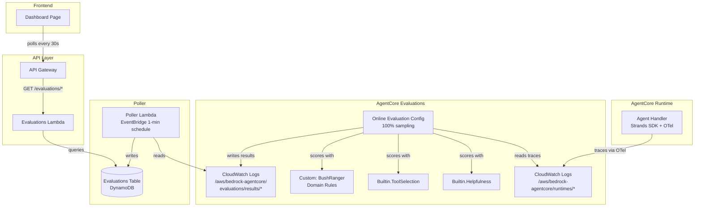

# Design Document: AgentCore Evaluations

## Overview

This design integrates Amazon Bedrock AgentCore Evaluations into the Bush Ranger AI project to provide automated, continuous quality assessment of agent invocations. The approach leverages AgentCore's native online evaluation infrastructure — which samples live OpenTelemetry traces from CloudWatch Logs and scores them using LLM-as-a-Judge — rather than building a custom evaluation pipeline.

The architecture has three layers:

1. **Evaluation Infrastructure (CDK)** — Provisions a custom evaluator (`AWS::BedrockAgentCore::Evaluator`) for Bush Ranger domain rules and an online evaluation configuration (`AWS::BedrockAgentCore::OnlineEvaluationConfig`) that wires the agent runtime's CloudWatch log group to three evaluators (Helpfulness, Tool Selection, Custom). A poller Lambda reads evaluation results from the CloudWatch results log group and writes them to a DynamoDB table for fast frontend queries.
2. **Results API (Lambda)** — A new Lambda handler (`evaluations_handler.py`) exposes `GET /evaluations/summary` and `GET /evaluations/recent` endpoints, following the same patterns as `analytics_handler.py`.
3. **Dashboard UI (React)** — A new section on the existing `DashboardPage` displays score cards, a time-series chart, and a recent evaluations table, using Cloudscape components and 30-second polling.

### Key Design Decision: Native Online Evaluation vs Custom Lambda Pipeline

The requirements describe an "Evaluation_Service Lambda" that calls the AgentCore Evaluations API directly after each invocation. However, AgentCore's online evaluation feature already does this natively — it samples traces from CloudWatch Logs and runs evaluators automatically. Using the native approach:

- Eliminates the need for the agent handler to invoke a separate Lambda
- Removes coupling between the agent response path and evaluation scoring
- Leverages AgentCore's built-in sampling, session detection, and result storage
- Simplifies IAM — no need for the agent role to invoke a Lambda

The trade-off is that results land in a CloudWatch log group rather than DynamoDB directly. A lightweight poller Lambda bridges this gap by reading from the results log group on a schedule and writing to DynamoDB for fast dashboard queries.

## Architecture



## Components and Interfaces

### 1. Custom Evaluator (`AWS::BedrockAgentCore::Evaluator`)

A session-level LLM-as-a-Judge evaluator that scores agent responses against Bush Ranger domain rules.

**CloudFormation resource type:** `AWS::BedrockAgentCore::Evaluator`

| Property | Value |
|---|---|
| `EvaluatorName` | `BushRangerDomainRules` |
| `Level` | `TRACE` |
| `EvaluatorConfig` | LLM-as-a-Judge with custom instructions |

The judge instructions use the `{context}` and `{assistant_turn}` placeholders (trace-level) and evaluate three dimensions:
- **Fire safety compliance** — When fire danger is high/very high/extreme, the response must include safety warnings
- **Content guardrails** — Response stays within conservation and wildlife domain
- **Location context accuracy** — Location references are consistent with user's stated location

The rating scale is numerical 0–1 with three levels:
- `1.0` ("pass") — All three rules satisfied
- `0.5` ("partial") — One or two rules violated
- `0.0` ("fail") — All three rules violated or critical safety omission

### 2. Online Evaluation Configuration (`AWS::BedrockAgentCore::OnlineEvaluationConfig`)

Wires the agent runtime's CloudWatch log group to the three evaluators.

| Property | Value |
|---|---|
| `OnlineEvaluationConfigName` | `bush_ranger_online_eval` |
| `DataSourceConfig` | Agent runtime CloudWatch log group |
| `Evaluators` | Helpfulness (built-in), ToolSelection (built-in), BushRangerDomainRules (custom) |
| `Rule.SamplingConfig` | 100% (workshop — evaluate every invocation) |
| `Rule.SessionConfig` | 5-minute timeout (workshop sessions are short) |
| `ExecutionStatus` | `ENABLED` |

### 3. Poller Lambda

A Python Lambda triggered by an EventBridge rule every 1 minute. It reads new evaluation result log events from the CloudWatch results log group and writes them to the Evaluations DynamoDB table.

**Interface:**
```python
def handler(event: dict, context: Any) -> dict:
    """Read new evaluation results from CloudWatch and write to DynamoDB."""
```

**Logic:**
1. Read the last-processed timestamp from a DynamoDB control record (partition key `_POLLER_STATE`)
2. Query CloudWatch Logs Insights for events since that timestamp
3. Parse each log event (OpenTelemetry evaluation result format) to extract evaluator name, score, rationale, trace ID, session ID
4. Batch-write `EvaluationResult` records to DynamoDB
5. Update the control record with the latest processed timestamp

### 4. Evaluations API Lambda (`evaluations_handler.py`)

A new Lambda handler following the `analytics_handler.py` pattern. Placed in `services/api/` alongside existing handlers.

**Endpoints:**

| Route | Method | Description |
|---|---|---|
| `/evaluations/summary` | GET | Average scores per evaluator over a time range |
| `/evaluations/recent` | GET | Most recent evaluation results (default limit: 20) |

**Query Parameters:**

| Parameter | Type | Default | Description |
|---|---|---|---|
| `start_date` | ISO-8601 date | 7 days ago | Start of time range |
| `end_date` | ISO-8601 date | today | End of time range |
| `limit` | integer | 20 | Max results for `/recent` |

**Response format** (matches existing analytics envelope):
```json
{
  "data": [...],
  "count": 3,
  "filters_applied": { "start_date": "2025-01-01", "end_date": "2025-01-07" }
}
```

### 5. Dashboard Evaluations Section

New React components added to the existing `DashboardPage.tsx`:

- `EvaluationScoreCards` — Three Cloudscape `Box` components showing average score per evaluator
- `EvaluationTrendChart` — Recharts `LineChart` with one line per evaluator over time
- `RecentEvaluationsTable` — Cloudscape `Table` showing recent evaluations with prompt summary, scores, timestamp

All components share a 30-second polling interval via `setInterval` + `useEffect`.

### 6. CDK Infrastructure Additions

New resources added to `BushRangerStack`:

| Resource | Type | Purpose |
|---|---|---|
| Evaluations DynamoDB Table | `dynamodb.Table` | Store evaluation results |
| Custom Evaluator | `CfnResource` (`AWS::BedrockAgentCore::Evaluator`) | Bush Ranger domain rules |
| Online Eval Config | `CfnResource` (`AWS::BedrockAgentCore::OnlineEvaluationConfig`) | Wire traces to evaluators |
| Poller Lambda | `_lambda.Function` | Bridge CW results → DynamoDB |
| EventBridge Rule | `events.Rule` | Trigger poller every 1 minute |
| Evaluations API Lambda | `_lambda.Function` | Serve evaluation endpoints |
| API Gateway Routes | `apigwv2.CfnRoute` | `/evaluations/summary`, `/evaluations/recent` |
| Evaluation Execution IAM Role | `iam.Role` | For online eval config to invoke models |
| CloudWatch Logs read policy | `iam.PolicyStatement` | Poller reads results log group |


## Data Models

### Evaluations DynamoDB Table

**Table name:** `BushRangerEvaluations`

| Attribute | Type | Key | Description |
|---|---|---|---|
| `invocation_id` | String | Partition Key | Unique trace/invocation identifier from OTel |
| `evaluator_ts` | String | Sort Key | Composite: `{evaluator_name}#{ISO-8601 timestamp}` |
| `evaluator_name` | String | — | e.g. `Builtin.Helpfulness`, `Builtin.ToolSelection`, `BushRangerDomainRules` |
| `score` | Number | — | Numeric score 0.0–1.0 |
| `rationale` | String | — | Textual explanation from the judge |
| `session_id` | String | — | Agent session identifier |
| `prompt_summary` | String | — | Truncated user prompt (first 200 chars) |
| `timestamp` | String | — | ISO-8601 evaluation timestamp |
| `ttl` | Number | — | TTL epoch (30 days) for automatic cleanup |

**GSI: `evaluator-timestamp-index`**

| Attribute | Type | Key |
|---|---|---|
| `evaluator_name` | String | Partition Key |
| `timestamp` | String | Sort Key |

This GSI enables the `/evaluations/summary` endpoint to efficiently query scores per evaluator within a time range.

**Billing:** On-demand (PAY_PER_REQUEST), consistent with the existing sightings table.

**Removal policy:** DESTROY (workshop project).

### Poller State Record

A single DynamoDB item in the Evaluations table tracks the poller's progress:

| Attribute | Value |
|---|---|
| `invocation_id` | `_POLLER_STATE` |
| `evaluator_ts` | `_CONTROL` |
| `last_processed_ts` | ISO-8601 timestamp of last processed log event |

### Shared Python Model (`models/evaluations.py`)

```python
TABLE_NAME = "BushRangerEvaluations"
PARTITION_KEY = "invocation_id"
SORT_KEY = "evaluator_ts"
GSI_NAME = "evaluator-timestamp-index"

@dataclass
class EvaluationResult:
    invocation_id: str
    evaluator_ts: str
    evaluator_name: str
    score: float
    rationale: str
    session_id: str
    prompt_summary: str
    timestamp: str
    ttl: int
```

### Frontend TypeScript Types (`frontend/src/analytics/evaluationTypes.ts`)

```typescript
export interface EvaluationSummary {
  evaluator_name: string;
  average_score: number;
  count: number;
}

export interface EvaluationResult {
  invocation_id: string;
  evaluator_name: string;
  score: number;
  rationale: string;
  prompt_summary: string;
  timestamp: string;
}

export interface EvaluationTrendPoint {
  date: string;       // YYYY-MM-DD
  evaluator_name: string;
  average_score: number;
  count: number;
}
```


## Correctness Properties

*A property is a characteristic or behavior that should hold true across all valid executions of a system — essentially, a formal statement about what the system should do. Properties serve as the bridge between human-readable specifications and machine-verifiable correctness guarantees.*

### Property 1: Evaluation result parsing round-trip

*For any* valid CloudWatch evaluation result log event containing an evaluator name, numeric score (0.0–1.0), rationale string, trace ID, and session ID, parsing the log event and building a DynamoDB item SHALL produce an item containing all required attributes (`invocation_id`, `evaluator_ts`, `evaluator_name`, `score`, `rationale`, `session_id`, `prompt_summary`, `timestamp`) with values matching the original log event data.

**Validates: Requirements 2.3, 3.4, 4.2**

### Property 2: Summary endpoint computes correct averages

*For any* set of evaluation results in the table with varying evaluator names and scores, the `/evaluations/summary` endpoint SHALL return one entry per distinct evaluator where the `average_score` equals the arithmetic mean of all scores for that evaluator within the requested time range, and `count` equals the number of results for that evaluator.

**Validates: Requirements 5.1**

### Property 3: Recent results ordering and limit

*For any* set of evaluation results in the table and any positive integer limit, the `/evaluations/recent` endpoint SHALL return at most `limit` results, ordered by timestamp descending (most recent first), and every returned result SHALL have a timestamp greater than or equal to any result not returned (i.e., no newer result is omitted while an older one is included).

**Validates: Requirements 5.2**

### Property 4: Invalid date parameters are rejected

*For any* string that does not match the ISO-8601 date format `YYYY-MM-DD`, when passed as `start_date` or `end_date` to any evaluations endpoint, the handler SHALL return a 400 status code with a JSON body containing an `error` field.

**Validates: Requirements 5.5**

## Error Handling

| Scenario | Handling |
|---|---|
| AgentCore online evaluation fails silently | No impact on agent — evaluation is fully decoupled. Results simply don't appear. Dashboard shows stale data. |
| Poller Lambda fails to read CloudWatch Logs | Lambda retries on next 1-minute schedule. `last_processed_ts` is not updated, so no results are lost. CloudWatch Logs retain data for the log group's retention period. |
| Poller Lambda fails to write to DynamoDB | Batch write failures are logged. Unprocessed items are retried on the next poller execution (timestamp not advanced past failed items). |
| Evaluations API receives invalid parameters | Returns 400 with descriptive error message (same pattern as analytics handler). |
| Evaluations API DynamoDB query fails | Returns 500 with generic "Internal server error" message. Error details logged to CloudWatch. |
| Frontend polling fails | React components show stale data with last-fetched timestamp. No error toast — silent degradation appropriate for a dashboard widget. |
| Custom evaluator LLM judge returns unexpected format | Poller skips malformed log events and logs a warning. Does not block processing of other events. |
| DynamoDB TTL expires old records | Expected behavior — 30-day TTL keeps table size manageable for workshop use. Dashboard naturally shows only recent data. |

## Testing Strategy

### Property-Based Tests (Hypothesis — Python)

The feature's core testable logic lives in two Python modules: the poller's log event parser and the evaluations API handler. These are pure functions with clear input/output behavior, making them ideal for property-based testing with [Hypothesis](https://hypothesis.readthedocs.io/).

Each property test runs a minimum of 100 iterations. Tests are tagged with the design property they validate.

**Library:** `hypothesis` (already in use — `.hypothesis/` directory exists in the project)

| Property | Module Under Test | Generator Strategy |
|---|---|---|
| Property 1: Parsing round-trip | `parse_evaluation_event()` | Random JSON log events with valid OTel evaluation fields |
| Property 2: Summary averages | `_handle_summary()` | Random lists of `EvaluationResult` dicts with varying evaluator names and scores |
| Property 3: Recent ordering | `_handle_recent()` | Random lists of `EvaluationResult` dicts with varying timestamps and a random limit |
| Property 4: Invalid dates | `_parse_filters()` | Random strings that don't match `YYYY-MM-DD` pattern |

### Unit Tests (pytest)

Example-based tests for specific scenarios:

- Poller handles empty CloudWatch response (no new events)
- Poller handles malformed log event (missing fields)
- Summary endpoint with no data returns empty array
- Recent endpoint with default limit returns up to 20 results
- API handler routes to correct handler function based on path
- CORS headers are present on all responses

### Integration Tests

- Deploy stack and verify all three evaluators produce results after an agent invocation
- Verify poller Lambda populates DynamoDB within 2 minutes of an agent invocation
- Verify `/evaluations/summary` and `/evaluations/recent` return data via API Gateway

### Frontend Tests

- Example-based tests verifying component rendering with mock data
- Verify 30-second polling interval is configured
- Verify Cloudscape components are used (import checks)
