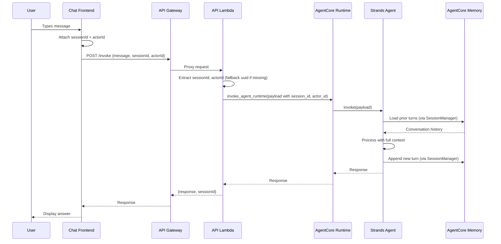
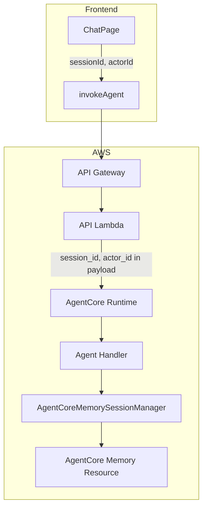

# Design Document: AgentCore Short-Term Memory

## Overview

This design adds turn-by-turn conversational memory to the Bush Ranger AI agent using the AgentCore Memory managed service. Currently, each invocation creates a stateless `Agent()` instance — the agent has no recall of prior turns. By integrating `AgentCoreMemorySessionManager` from the Strands SDK, the agent will automatically load prior conversation turns and append new ones, scoped per user session.

The integration touches four layers:

1. **Frontend** — generates a `session_id` per chat session and extracts `actorId` from the Cognito JWT, sending both with every `/invoke` request.
2. **API Lambda** — passes `sessionId` and `actorId` through to the AgentCore Runtime payload.
3. **Agent Handler** — uses `AgentCoreMemoryConfig` + `AgentCoreMemorySessionManager` to wire memory into the `Agent()` constructor.
4. **CDK Infrastructure** — provisions the AgentCore Memory resource and grants the agent role the required IAM permissions.

### Key Design Decisions

- **Short-term memory only**: No long-term memory strategies are in scope. The `AgentCoreMemoryConfig` is configured with short-term mode exclusively.
- **Graceful degradation**: If memory is unavailable (missing `MEMORY_ID`, service errors), the agent falls back to stateless operation rather than failing.
- **Session lifecycle tied to frontend state**: The `session_id` lives in React component state — a page refresh or sign-out starts a new session. This is intentional for simplicity.
- **Memory resource via CDK Custom Resource**: Since CDK L2 constructs for AgentCore Memory don't exist yet, we use an `AwsCustomResource` that calls the `bedrock-agentcore` boto3 API to create the memory resource at deploy time.

## Architecture





## Components and Interfaces

### 1. ChatPage (Frontend)

**File**: `frontend/src/chat/ChatPage.tsx`

**Changes**:
- Add `sessionId` state initialized via `crypto.randomUUID()` on mount.
- Extract `actorId` from the Cognito access token's `sub` claim using base64 JWT decoding (no library needed — the token is already validated server-side).
- Pass `sessionId` and `actorId` to `invokeAgent()`.
- Reset `sessionId` on sign-out; generate new one on sign-in.

```typescript
// Session ID — generated once per chat session
const [sessionId, setSessionId] = useState<string>(() => crypto.randomUUID());

// Extract sub claim from JWT access token (base64 decode the payload)
function extractActorId(token: string | null): string | undefined {
  if (!token) return undefined;
  try {
    const payload = JSON.parse(atob(token.split('.')[1]));
    return payload.sub;
  } catch {
    return undefined;
  }
}
```

### 2. invokeAgent (Frontend API)

**File**: `frontend/src/api/agent.ts`

**Changes**:
- Accept optional `sessionId` and `actorId` parameters.
- Include them in the request body.

```typescript
export async function invokeAgent(
  message: string,
  accessToken: string | null,
  location?: { lat: number; lng: number } | null,
  sessionId?: string,
  actorId?: string,
): Promise<Response> {
  // ... existing logic ...
  const body: Record<string, unknown> = { message };
  if (location) body.location = location;
  if (sessionId) body.sessionId = sessionId;
  if (actorId) body.actorId = actorId;
  // ...
}
```

### 3. API Lambda

**File**: `services/api/handler.py`

**Changes**:
- Extract `actorId` from the request body.
- Include `session_id` and `actor_id` in the agent payload (not just the `runtimeSessionId`).

```python
session_id = body.get("sessionId") or str(uuid.uuid4())
actor_id = body.get("actorId")

agent_payload: dict[str, object] = {"prompt": message}
agent_payload["session_id"] = session_id
if actor_id:
    agent_payload["actor_id"] = actor_id
if location:
    agent_payload["location"] = location
```

### 4. Agent Handler

**File**: `services/agent/handler.py`

**Changes**:
- Read `MEMORY_ID` from environment variables.
- Create `AgentCoreMemoryConfig` with `memory_id`, `session_id`, and `actor_id`.
- Instantiate `AgentCoreMemorySessionManager` and pass as `session_manager` to `Agent()`.
- Graceful fallback if memory is unavailable.

```python
from bedrock_agentcore.memory.integrations.strands.config import AgentCoreMemoryConfig
from bedrock_agentcore.memory.integrations.strands.session_manager import AgentCoreMemorySessionManager

MEMORY_ID = os.environ.get("MEMORY_ID", "")

def _build_session_manager(
    session_id: str, actor_id: str | None
) -> AgentCoreMemorySessionManager | None:
    if not MEMORY_ID:
        logger.warning("MEMORY_ID not configured, running without memory")
        return None
    try:
        config = AgentCoreMemoryConfig(
            memory_id=MEMORY_ID,
            session_id=session_id,
            actor_id=actor_id or "anonymous",
        )
        return AgentCoreMemorySessionManager(config=config)
    except Exception:
        logger.exception("Failed to initialize memory session manager")
        return None
```

In the `invoke` entrypoint:

```python
session_id = payload.get("session_id", str(uuid.uuid4()))
actor_id = payload.get("actor_id")
session_manager = _build_session_manager(session_id, actor_id)

agent = Agent(
    model=model,
    system_prompt=SYSTEM_PROMPT,
    tools=mcp_clients,
    session_manager=session_manager,  # None = stateless fallback
)
```

### 5. CDK Stack — Memory Resource

**File**: `infra/stacks/bush_ranger_stack.py`

**Changes**:
- Add `_create_memory_resource()` method that uses `AwsCustomResource` to call `CreateMemory` via the `bedrock-agentcore` boto3 API.
- Pass `MEMORY_ID` as an environment variable to the agent runtime.
- Add IAM permissions for `bedrock-agentcore:InvokeMemory` and `bedrock-agentcore:RetrieveMemory` to the agent role.

```python
def _create_memory_resource(self) -> cr.AwsCustomResource:
    """Create an AgentCore Memory resource using a Custom Resource.

    CDK L2 constructs don't exist yet for AgentCore Memory,
    so we use AwsCustomResource to call the boto3 API directly.
    """
    memory_resource = cr.AwsCustomResource(
        self,
        "AgentCoreMemoryResource",
        on_create=cr.AwsSdkCall(
            service="BedrockAgentCore",
            action="createMemory",
            parameters={
                "name": "bush-ranger-short-term-memory",
                "description": "Short-term conversational memory for Bush Ranger AI",
                "memoryStrategies": [],  # short-term only, no strategies needed
            },
            physical_resource_id=cr.PhysicalResourceId.from_response("memoryId"),
        ),
        on_delete=cr.AwsSdkCall(
            service="BedrockAgentCore",
            action="deleteMemory",
            parameters={
                "memoryId": cr.PhysicalResourceIdReference(),
            },
        ),
        policy=cr.AwsCustomResourcePolicy.from_statements([
            iam.PolicyStatement(
                actions=[
                    "bedrock-agentcore:CreateMemory",
                    "bedrock-agentcore:DeleteMemory",
                ],
                resources=["*"],
            ),
        ]),
    )
    return memory_resource
```


## Data Models

### Frontend Request Body

```typescript
interface InvokeRequestBody {
  message: string;
  sessionId?: string;       // UUID v4, generated by ChatPage
  actorId?: string;         // Cognito sub claim from JWT
  location?: {
    lat: number;
    lng: number;
  };
}
```

### Frontend Response Body

```typescript
interface InvokeResponseBody {
  response: string;
  sessionId: string;        // Echoed back for confirmation
}
```

### Agent Payload (Lambda → AgentCore Runtime)

```python
# Payload sent to the agent handler via AgentCore Runtime
{
    "prompt": str,           # User message
    "session_id": str,       # UUID — from frontend or Lambda-generated fallback
    "actor_id": str | None,  # Cognito sub claim, optional
    "location": {            # Optional geolocation
        "lat": float,
        "lng": float,
    } | None,
}
```

### AgentCoreMemoryConfig

```python
# From bedrock_agentcore.memory.integrations.strands.config
AgentCoreMemoryConfig(
    memory_id=str,      # ID of the pre-created Memory resource
    session_id=str,     # Conversation session identifier
    actor_id=str,       # User identifier (Cognito sub or "anonymous")
)
```

### CDK Environment Variables (Agent Runtime)

| Variable | Source | Description |
|----------|--------|-------------|
| `MEMORY_ID` | Custom Resource output | AgentCore Memory resource identifier |
| `WILDLIFE_SIGHTINGS_RUNTIME_ARN` | Existing | MCP server runtime ARN |
| `CONSERVATION_DOCS_RUNTIME_ARN` | Existing | MCP server runtime ARN |
| `WEATHER_RUNTIME_ARN` | Existing | MCP server runtime ARN |
| `COGNITO_TOKEN_URL` | Existing | Cognito OAuth2 token endpoint |
| `COGNITO_M2M_CLIENT_ID` | Existing | M2M client ID |
| `COGNITO_M2M_CLIENT_SECRET` | Existing | M2M client secret |
| `COGNITO_M2M_SCOPE` | Existing | OAuth2 scope |

### IAM Permissions (Agent Role Additions)

```json
{
  "Effect": "Allow",
  "Action": [
    "bedrock-agentcore:InvokeMemory",
    "bedrock-agentcore:RetrieveMemory"
  ],
  "Resource": "arn:aws:bedrock-agentcore:{region}:{account}:memory/{memoryId}"
}
```


## Correctness Properties

*A property is a characteristic or behavior that should hold true across all valid executions of a system — essentially, a formal statement about what the system should do. Properties serve as the bridge between human-readable specifications and machine-verifiable correctness guarantees.*

### Property 1: Session ID included in every request

*For any* message sent by the ChatPage while a session_id exists in component state, the request body sent to `/invoke` shall contain a `sessionId` field equal to the stored session_id.

**Validates: Requirements 1.2**

### Property 2: Actor ID extraction from JWT

*For any* valid JWT access token containing a `sub` claim, the `extractActorId` function shall return the exact value of the `sub` claim.

**Validates: Requirements 2.1**

### Property 3: Invalid token yields no actor ID

*For any* input that is null, undefined, not a valid JWT, or a JWT missing the `sub` claim, the `extractActorId` function shall return `undefined`.

**Validates: Requirements 2.2**

### Property 4: Lambda payload passthrough

*For any* request body containing `sessionId` and/or `actorId` fields, the API Lambda shall include those same values as `session_id` and `actor_id` respectively in the agent payload forwarded to AgentCore Runtime.

**Validates: Requirements 3.1, 3.2**

### Property 5: Lambda fallback session ID

*For any* request body that does not contain a `sessionId` field, the API Lambda shall generate a `session_id` in the agent payload that is a valid UUID v4 string.

**Validates: Requirements 3.3**

### Property 6: Memory config construction

*For any* valid triple of (`session_id`, `actor_id`, `memory_id`), the `_build_session_manager` function shall create an `AgentCoreMemoryConfig` whose `memory_id`, `session_id`, and `actor_id` attributes match the input values.

**Validates: Requirements 4.1**

### Property 7: New session starts empty

*For any* previously unused `session_id`, the conversation history retrieved by the Session_Manager shall be empty.

**Validates: Requirements 8.2**

### Property 8: Conversation history round-trip

*For any* sequence of N messages sent within a single session (same `session_id` and `actor_id`), after all messages are processed, the conversation history retrieved from memory shall contain all N user turns and their corresponding agent responses, in the original order.

**Validates: Requirements 8.3**

## Error Handling

### Frontend

| Scenario | Behavior |
|----------|----------|
| `crypto.randomUUID()` unavailable | Fall back to a manual UUID generator (unlikely in modern browsers, but defensive) |
| JWT decode fails (malformed token) | `extractActorId` returns `undefined`; request sent without `actorId` |
| Network error on `/invoke` | Existing error handling in `ChatPage` displays user-friendly message |

### API Lambda

| Scenario | Behavior |
|----------|----------|
| Missing `sessionId` in request | Generate fallback UUID via `uuid.uuid4()` |
| Missing `actorId` in request | Omit `actor_id` from agent payload |
| AgentCore Runtime invocation fails | Return 500 with generic error (existing behavior) |

### Agent Handler

| Scenario | Behavior |
|----------|----------|
| `MEMORY_ID` env var not set | Log warning, create Agent without `session_manager` |
| `AgentCoreMemoryConfig` construction fails | Log exception, create Agent without `session_manager` |
| `AgentCoreMemorySessionManager` init fails | Log exception, create Agent without `session_manager` |
| Memory service unavailable at runtime | Strands SDK handles this internally; if it raises, the agent invocation error handler catches it and returns an error response |

### CDK Stack

| Scenario | Behavior |
|----------|----------|
| `CreateMemory` API call fails during deploy | CloudFormation rolls back the custom resource and the stack |
| `DeleteMemory` fails during stack deletion | Custom resource reports failure; may require manual cleanup |

## Testing Strategy

### Property-Based Testing

**Library**: [Hypothesis](https://hypothesis.readthedocs.io/) for Python, [fast-check](https://fast-check.dev/) for TypeScript.

Each property test must:
- Run a minimum of 100 iterations
- Reference its design property via a comment tag
- Format: `# Feature: agentcore-short-term-memory, Property {N}: {title}`

**Python property tests** (Agent Handler, API Lambda):

| Property | Test Description |
|----------|-----------------|
| Property 4 | Generate random request bodies with/without sessionId and actorId. Verify the Lambda handler constructs the correct agent payload. |
| Property 5 | Generate random request bodies without sessionId. Verify the Lambda generates a valid UUID v4 in the payload. |
| Property 6 | Generate random (memory_id, session_id, actor_id) triples. Verify `_build_session_manager` creates a config with matching attributes. |

**TypeScript property tests** (Frontend):

| Property | Test Description |
|----------|-----------------|
| Property 1 | Generate random messages. Verify the request body always includes the current sessionId. |
| Property 2 | Generate random JWT payloads with `sub` claims. Encode as JWTs. Verify `extractActorId` returns the correct sub. |
| Property 3 | Generate random invalid inputs (null, empty string, malformed base64, JWTs without sub). Verify `extractActorId` returns undefined. |

**Integration property tests** (Properties 7, 8 — require a running AgentCore Memory service):

| Property | Test Description |
|----------|-----------------|
| Property 7 | Generate random unused session_ids. Verify the session manager returns empty history. |
| Property 8 | Generate random sequences of messages for a session. Send them, then retrieve history. Verify all turns are present in order. |

Properties 7 and 8 are integration-level tests that depend on the AgentCore Memory service. They should be run in a deployed environment or with a mock/stub of the memory service for unit-level validation.

### Unit Tests

Unit tests complement property tests by covering specific examples, edge cases, and integration points:

- **Frontend**: Session ID generated on mount; session ID reset on sign-out; new session ID on sign-in; actorId omitted when token is null.
- **API Lambda**: Passthrough with all fields present; fallback UUID when sessionId missing; actorId omitted when not in request.
- **Agent Handler**: Agent created with session_manager when MEMORY_ID is set; Agent created without session_manager when MEMORY_ID is empty; Agent created without session_manager when SessionManager init throws.
- **CDK Stack**: Synthesized template contains custom resource for memory; MEMORY_ID env var wired to agent runtime; IAM policy contains InvokeMemory and RetrieveMemory actions scoped to memory resource ARN; stack output for memory ID exists.
- **Dependencies**: `requirements.txt` contains `bedrock-agentcore[strands]`.
