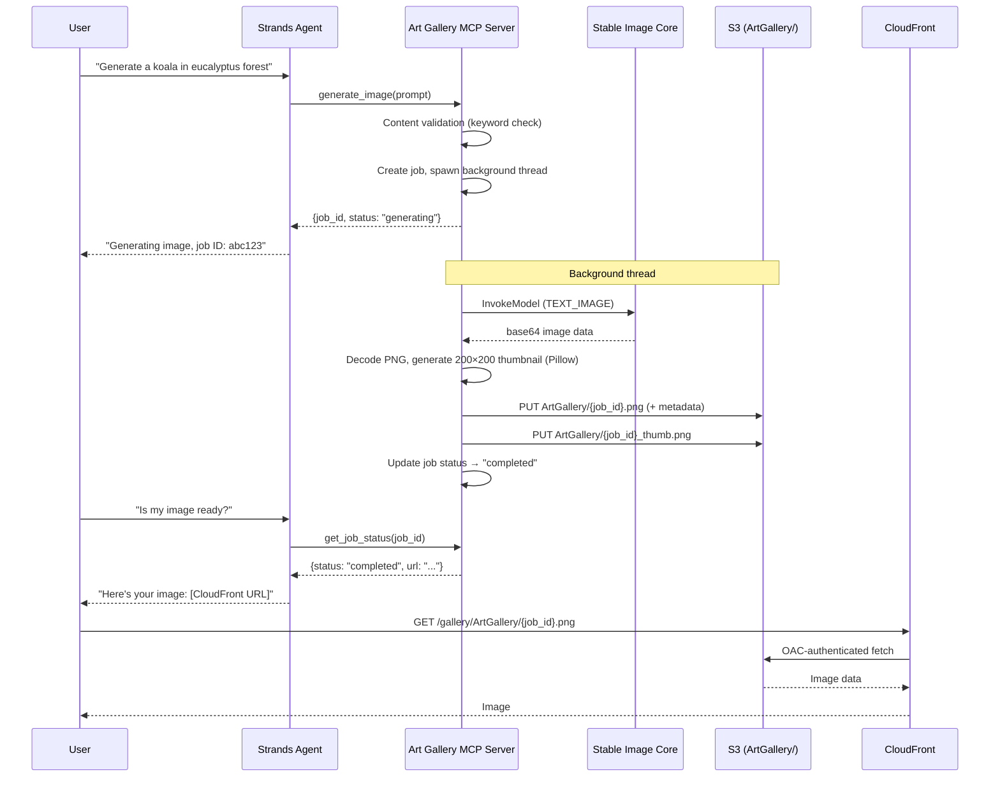
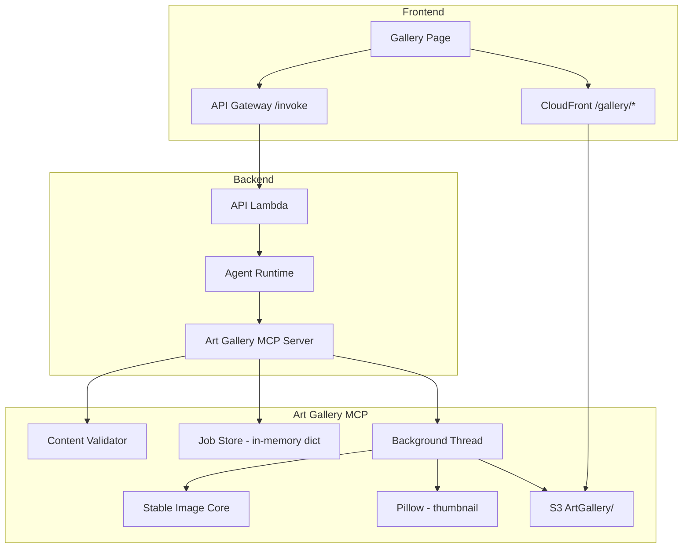

# Design Document: Art Gallery

## Overview

The Art Gallery feature adds AI-powered image generation of Australian wildlife and nature to Bush Ranger AI. It introduces a new `art-gallery` MCP server that wraps Stability AI Stable Image Core via Bedrock, with content guardrails restricting prompts to Australian wildlife/nature themes. Image generation runs asynchronously in background threads so the agent responds immediately with a job ID. Generated images (full-size + thumbnails) are stored in S3 under an `ArtGallery/` prefix and served via the existing CloudFront distribution with OAC. A new React Gallery page displays thumbnails in a responsive grid with click-to-expand modal.

### Key Design Decisions

- **Async via background threads** (not Lambda/Step Functions): Keeps the architecture simple — the MCP server spawns a thread per generation request and tracks status in an in-memory dict. Trade-off: jobs are lost on restart, which is acceptable for a non-critical image generation feature.
- **In-memory job store**: A Python `dict` keyed by job ID. No DynamoDB table needed. Gallery browsing uses S3 `list_objects_v2` directly, so persisted images survive restarts even though job tracking doesn't.
- **Server-side thumbnails via Pillow**: 200×200 thumbnails generated in the MCP server before uploading to S3, avoiding client-side resizing and reducing bandwidth.
- **CloudFront with OAC**: Reuses the existing distribution by adding a `/gallery/*` cache behavior pointing to the frontend S3 bucket's `ArtGallery/` prefix. No presigned URLs, no public bucket.
- **Content guardrails**: Two-layer approach — keyword validation against allowed topics + a system prompt prefix prepended to every approved prompt.

## Architecture





## Components and Interfaces

### 1. Art Gallery MCP Server (`services/mcp_servers/art_gallery/server.py`)

A FastMCP server exposing three tools:

#### `generate_image(prompt: str) -> dict`
- Validates prompt via `ContentValidator`
- Creates a job entry in the in-memory `JobStore`
- Spawns a background thread to invoke Bedrock and upload to S3
- Returns `{job_id, status: "generating"}` immediately

#### `get_job_status(job_id: str) -> dict`
- Looks up job in `JobStore`
- Returns status-dependent response:
  - `"generating"`: `{job_id, status}`
  - `"completed"`: `{job_id, status, s3_key, cloudfront_url}`
  - `"failed"`: `{job_id, status, error}`
  - Not found: `{error: "Job not found"}`

#### `list_gallery_images() -> dict`
- Calls `s3.list_objects_v2(Prefix="ArtGallery/")` 
- Filters to full-size images (excludes `_thumb.png`)
- For each image, reads S3 object metadata (prompt, timestamp)
- Returns list of `{s3_key, prompt, timestamp, thumbnail_url, full_url}`

### 2. Content Validator (`ContentValidator` class in server.py)

```python
ALLOWED_TOPICS = [
    "kangaroo", "koala", "wombat", "platypus", "echidna", "emu",
    "kookaburra", "cockatoo", "quokka", "bilby", "numbat", "cassowary",
    "crocodile", "dugong", "possum", "glider", "wallaby", "quoll",
    "devil", "parrot", "eagle", "turtle", "tortoise", "honeyeater",
    "australian", "outback", "bush", "reef", "eucalyptus", "rainforest",
    "desert", "wetland", "mangrove", "national park", "wildlife",
    "nature", "landscape", "marine", "coral", "banksia", "wattle",
    "gum tree", "fern", "wildflower",
]

SYSTEM_PROMPT_PREFIX = "Generate a realistic image of Australian wildlife or nature: "
```

- `validate(prompt: str) -> bool`: Checks if any allowed topic keyword appears in the lowercased prompt
- `build_full_prompt(prompt: str) -> str`: Prepends `SYSTEM_PROMPT_PREFIX` to the validated prompt

### 3. Job Store (in-memory)

```python
@dataclass
class Job:
    job_id: str
    status: str  # "generating" | "completed" | "failed"
    prompt: str
    created_at: str  # ISO 8601
    s3_key: str | None = None
    cloudfront_url: str | None = None
    error: str | None = None

# In-memory store
_jobs: dict[str, Job] = {}
```

### 4. Image Generator (background thread function)

```python
def _generate_image_background(job_id: str, full_prompt: str) -> None:
    """Run in background thread: invoke Bedrock, create thumbnail, upload to S3."""
```

- Calls `bedrock_runtime.invoke_model()` with Stable Image Core payload
- Decodes base64 response → PNG bytes
- Uses Pillow to create 200×200 thumbnail
- Uploads both to S3 with metadata (prompt, timestamp)
- Updates job status to "completed" or "failed"

### 5. Frontend Gallery Page (`frontend/src/gallery/GalleryPage.tsx`)

- Fetches gallery images via the agent (chat-based: "list gallery images")
- Displays thumbnails in a Cloudscape `Grid` with responsive columns
- Each card shows thumbnail, prompt text, and date
- Click opens a Cloudscape `Modal` with the full-size image
- Loading state: Cloudscape `Spinner`
- Empty state: Cloudscape `Box` with informational message

### 6. CDK Infrastructure Changes (`infra/stacks/bush_ranger_stack.py`)

- New IAM role for art-gallery MCP server (Bedrock InvokeModel + S3 PutObject)
- New CloudWatch log group `/bush-ranger/mcp/art-gallery`
- New AgentCore runtime for the art-gallery container
- New CloudFront cache behavior: `/gallery/*` → S3 origin with OAC
- Agent runtime env var: `ART_GALLERY_RUNTIME_ARN`
- Agent handler updated to connect to art-gallery MCP server

## Data Models

### Job (in-memory)

| Field | Type | Description |
|-------|------|-------------|
| `job_id` | `str` | UUID4 identifier |
| `status` | `str` | One of: `"generating"`, `"completed"`, `"failed"` |
| `prompt` | `str` | Original user prompt (before prefix) |
| `created_at` | `str` | ISO 8601 timestamp |
| `s3_key` | `str \| None` | S3 object key (set on completion) |
| `cloudfront_url` | `str \| None` | Full CloudFront URL (set on completion) |
| `error` | `str \| None` | Error message (set on failure) |

### S3 Object Layout

| Key Pattern | Content | Metadata |
|-------------|---------|----------|
| `ArtGallery/{job_id}.png` | Full-size 1024×1024 PNG | `x-amz-meta-prompt`, `x-amz-meta-timestamp` |
| `ArtGallery/{job_id}_thumb.png` | 200×200 thumbnail PNG | `x-amz-meta-prompt`, `x-amz-meta-timestamp` |

### Stable Image Core Request

```json
{
  "prompt": "<SYSTEM_PROMPT_PREFIX + user prompt, max 512 chars>",
  "output_format": "png",
  "aspect_ratio": "1:1",
  "seed": "<random 0-4294967295>"
}
```

### Gallery Image Entry (returned by `list_gallery_images`)

```json
{
  "s3_key": "ArtGallery/abc123.png",
  "prompt": "A koala sitting in a eucalyptus tree",
  "timestamp": "2025-07-15T10:30:00Z",
  "thumbnail_url": "https://<cf-domain>/gallery/ArtGallery/abc123_thumb.png",
  "full_url": "https://<cf-domain>/gallery/ArtGallery/abc123.png"
}
```

## Correctness Properties

*A property is a characteristic or behavior that should hold true across all valid executions of a system — essentially, a formal statement about what the system should do. Properties serve as the bridge between human-readable specifications and machine-verifiable correctness guarantees.*

### Property 1: Content validation correctness

*For any* prompt string, the Content Validator SHALL approve the prompt if and only if the lowercased prompt contains at least one keyword from the allowed topics list. Prompts without any allowed keyword SHALL be rejected with a descriptive error.

**Validates: Requirements 2.2, 2.3**

### Property 2: System prompt prefix is prepended

*For any* approved prompt string, `build_full_prompt(prompt)` SHALL return a string that starts with `"Generate a realistic image of Australian wildlife or nature: "` followed by the original prompt, and the total length SHALL not exceed 512 characters.

**Validates: Requirements 2.4**

### Property 3: Job creation returns unique IDs with generating status

*For any* sequence of valid prompts submitted to `generate_image`, each returned response SHALL contain a `job_id` that is unique across all responses and a `status` of `"generating"`.

**Validates: Requirements 1.2**

### Property 4: Job completion reflects Bedrock outcome

*For any* job where the background thread completes, if Bedrock returns a valid base64 image response then the job status SHALL be `"completed"` with a non-null `s3_key` and `cloudfront_url`; if Bedrock raises an exception then the job status SHALL be `"failed"` with a non-null `error` message.

**Validates: Requirements 1.4, 1.5**

### Property 5: Job status response contains correct fields per status

*For any* job in the Job Store, `get_job_status(job_id)` SHALL return: for `"generating"` jobs — `job_id` and `status`; for `"completed"` jobs — `job_id`, `status`, `s3_key`, and `cloudfront_url`; for `"failed"` jobs — `job_id`, `status`, and `error`. The returned `status` SHALL match the job's actual status.

**Validates: Requirements 3.2, 3.3, 3.4**

### Property 6: Image storage uses correct key pattern and metadata

*For any* job ID and prompt, the full-size image SHALL be stored at S3 key `"ArtGallery/{job_id}.png"` with Content-Type `"image/png"`, and the S3 object metadata SHALL include the original prompt and an ISO 8601 timestamp.

**Validates: Requirements 5.1, 5.4**

### Property 7: Thumbnail generation produces correct dimensions and key

*For any* generated image of arbitrary dimensions, the thumbnail SHALL be exactly 200×200 pixels, stored at S3 key `"ArtGallery/{job_id}_thumb.png"`, and the corresponding CloudFront URL SHALL follow the pattern `https://<cf-domain>/gallery/ArtGallery/{job_id}_thumb.png`.

**Validates: Requirements 5.5, 5.7**

### Property 8: Gallery listing returns complete entries

*For any* set of images stored in S3 under the `"ArtGallery/"` prefix, `list_gallery_images` SHALL return one entry per full-size image (excluding thumbnails), and each entry SHALL contain `s3_key`, `prompt`, `timestamp`, `thumbnail_url`, and `full_url`.

**Validates: Requirements 4.2**

### Property 9: Gallery card renders prompt and date

*For any* gallery image entry with a non-empty prompt and valid timestamp, the rendered gallery card SHALL display the prompt text and a formatted generation date.

**Validates: Requirements 7.6**

## Error Handling

### MCP Server Errors

| Error Scenario | Handling | Response |
|---|---|---|
| Prompt fails content validation | Reject immediately, no job created | `{error: "content_validation_failed", message: "Prompt must relate to Australian wildlife or nature. Allowed topics include: Australian animals, plants, landscapes, national parks, marine life."}` |
| Prompt exceeds 512 chars after prefix | Reject immediately | `{error: "prompt_too_long", message: "Prompt exceeds maximum length of 512 characters (including system prefix)."}` |
| Bedrock InvokeModel fails | Update job to "failed" in background thread | Job error field contains sanitized error message |
| Bedrock returns invalid/empty response | Update job to "failed" | `{error: "generation_failed", message: "Image generation produced no output."}` |
| S3 upload fails | Update job to "failed" | Job error field contains "Failed to store image" |
| S3 list_objects_v2 fails | Return error from list_gallery_images | `{error: "gallery_unavailable", message: "Unable to retrieve gallery images."}` |
| Job ID not found | Return not-found error | `{error: "job_not_found", message: "No job found with ID: {job_id}"}` |
| Pillow thumbnail generation fails | Update job to "failed" | Job error field contains "Thumbnail generation failed" |

### Frontend Errors

| Error Scenario | Handling |
|---|---|
| Gallery fetch fails | Display Cloudscape `Alert` with retry option |
| Image fails to load | Show placeholder with broken-image icon |
| CloudFront returns 403/404 | Display error message in modal |

### Thread Safety

- The `_jobs` dict is accessed from both the main thread (read/write on create, read on status check) and background threads (write on completion/failure). Use `threading.Lock` to synchronize access.
- Each background thread operates on its own job ID, so contention is minimal.

## Testing Strategy

### Unit Tests (Python — pytest)

- **Content Validator**: Test allowed/rejected prompts with specific examples, edge cases (empty string, whitespace-only, mixed case)
- **System Prompt Prefix**: Verify prefix prepending and length truncation
- **Job Store**: CRUD operations, thread-safe access
- **get_job_status**: Response shape for each status, not-found case
- **list_gallery_images**: Parsing S3 responses, filtering thumbnails, empty gallery
- **Image generation background**: Mock Bedrock + S3, verify success/failure flows

### Unit Tests (TypeScript — vitest)

- **GalleryPage**: Render with mock data, empty state, loading state, click-to-expand modal
- **Gallery card**: Prompt and date display

### Property-Based Tests (Python — Hypothesis)

Property-based tests validate universal properties across randomly generated inputs. Each test runs a minimum of 100 iterations.

| Property | Test Description | Tag |
|---|---|---|
| Property 1 | Generate random strings, verify validation matches keyword presence | `Feature: art-gallery, Property 1: Content validation correctness` |
| Property 2 | Generate random valid prompts, verify prefix prepending | `Feature: art-gallery, Property 2: System prompt prefix is prepended` |
| Property 3 | Generate multiple valid prompts, verify unique job IDs | `Feature: art-gallery, Property 3: Job creation returns unique IDs` |
| Property 4 | Mock Bedrock success/failure, verify job status outcome | `Feature: art-gallery, Property 4: Job completion reflects Bedrock outcome` |
| Property 5 | Generate jobs in each status, verify response fields | `Feature: art-gallery, Property 5: Job status response contains correct fields` |
| Property 6 | Generate random job IDs/prompts, verify S3 key and metadata | `Feature: art-gallery, Property 6: Image storage correctness` |
| Property 7 | Generate random image sizes, verify thumbnail is 200×200 | `Feature: art-gallery, Property 7: Thumbnail generation correctness` |
| Property 8 | Generate random S3 listings, verify entry completeness | `Feature: art-gallery, Property 8: Gallery listing completeness` |

### Property-Based Tests (TypeScript — fast-check + vitest)

| Property | Test Description | Tag |
|---|---|---|
| Property 9 | Generate random gallery entries, verify card renders prompt and date | `Feature: art-gallery, Property 9: Gallery card renders prompt and date` |

### Integration Tests

- **End-to-end generation flow**: Mock Bedrock, verify generate → poll → completed with real S3 (localstack or moto)
- **Async behavior**: Verify generate_image returns before Bedrock mock completes
- **CDK assertions**: Verify IAM roles, CloudFront behaviors, log groups, runtime registrations

### Test Libraries

- **Python**: pytest, hypothesis, moto (S3 mocking), unittest.mock
- **TypeScript**: vitest, fast-check, @testing-library/react
