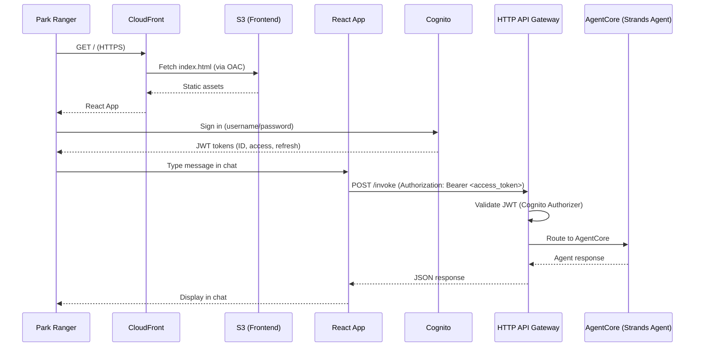
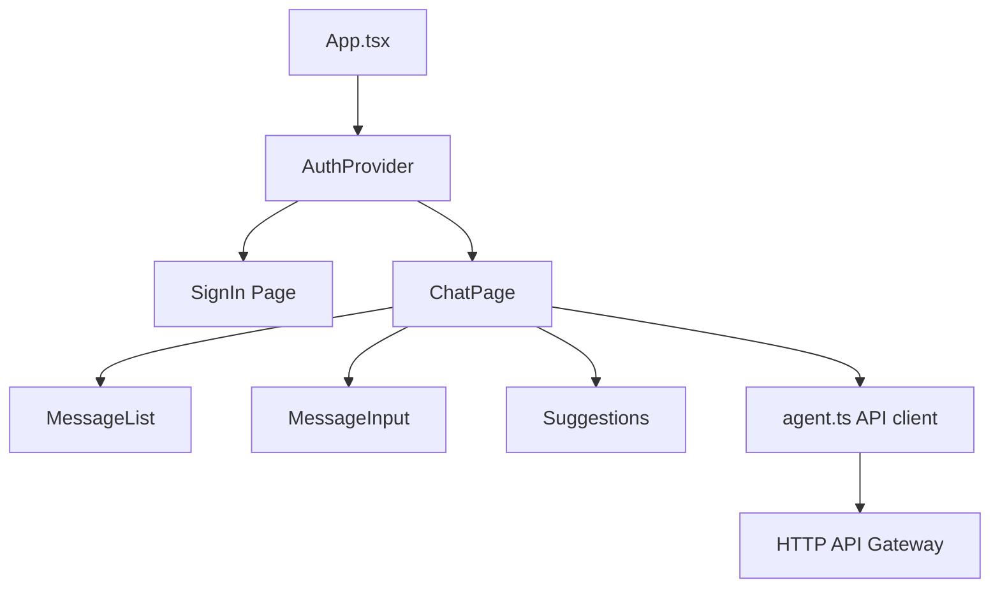

# Design Document

## Overview

Bush Ranger AI is an Australian Wildlife & Conservation Agent deployed on AWS AgentCore. The system uses AWS CDK (Python) to provision all infrastructure in us-east-1, including three custom MCP servers (Wildlife Sightings via DynamoDB, Conservation Docs via S3, Weather via Open-Meteo API), one third-party MCP server (Fetch Server), and a Strands Agent that orchestrates them using Claude Sonnet and Claude Haiku via Amazon Bedrock.

The system includes a React frontend built with AWS CloudScape Design System, hosted on S3 via CloudFront (private bucket with OAC). Park rangers authenticate via Amazon Cognito and interact with the agent through an HTTP API Gateway that validates JWT tokens before routing requests to AgentCore.

## Architecture

### System Components

```
┌──────────┐     ┌──────────────┐     ┌──────────────┐     ┌──────────────┐
│  Park    │────▶│ CloudFront   │────▶│ S3 Bucket    │     │  Cognito     │
│  Ranger  │     │ Distribution │     │ (private)    │     │  User Pool   │
│ (Browser)│     │ (HTTPS/OAC)  │     │ React App    │     │              │
└──────────┘     └──────────────┘     └──────────────┘     └──────┬───────┘
      │                                                           │
      │  JWT Token                                                │
      ▼                                                           │
┌──────────────────────────────────────────────────────────────────┘
│
▼
┌──────────────────┐
│  HTTP API        │◀── Cognito JWT Authorizer
│  Gateway         │
└────────┬─────────┘
         │
         ▼
┌─────────────────────────────────────────────────────────────────┐
│                      AWS AgentCore (us-east-1)                  │
│                                                                 │
│  ┌──────────────────────────────────────────────────────────┐   │
│  │                   Strands Agent                          │   │
│  │              (Bush Ranger AI)                            │   │
│  │         Claude Sonnet (primary reasoning)                │   │
│  │         Claude Haiku (light tasks)                       │   │
│  └────┬──────────┬──────────┬──────────┬────────────────────┘   │
│       │          │          │          │                         │
│  ┌────▼────┐ ┌──▼──────┐ ┌▼────────┐ ┌▼──────────────┐        │
│  │Wildlife │ │Conserv. │ │Weather  │ │Fetch Server   │        │
│  │Sightings│ │Docs     │ │& Climate│ │(3rd party)    │        │
│  │Server   │ │Server   │ │Server   │ │@mcp/fetch     │        │
│  └────┬────┘ └────┬────┘ └────┬────┘ └───────┬───────┘        │
│       │           │           │               │                 │
└───────┼───────────┼───────────┼───────────────┼─────────────────┘
        │           │           │               │
   ┌────▼────┐ ┌───▼────┐ ┌───▼──────────┐ ┌──▼──────────┐
   │DynamoDB │ │S3 Docs │ │Open-Meteo    │ │Government   │
   │Table    │ │Bucket  │ │API (free)    │ │Wildlife     │
   │         │ │        │ │              │ │Websites     │
   └─────────┘ └────────┘ └──────────────┘ └─────────────┘
```

### Request Flow



### Project Structure

The project separates infrastructure (CDK) from runtime services (agent, MCP servers) using top-level `infra/` and `services/` directories. The `models/` package stays at the project root as the shared contract between infra and services.

```
bush-ranger-ai/
├── infra/                              # All CDK/infrastructure code
│   ├── app.py                          # CDK entry point
│   ├── cdk.json                        # CDK configuration
│   ├── cdk.context.json                # CDK context (generated)
│   └── stacks/
│       └── bush_ranger_stack.py        # Single CDK stack — all resources
├── services/                           # All runtime service code
│   ├── agent/
│   │   ├── __init__.py
│   │   ├── handler.py                  # Strands Agent entry point
│   │   ├── prompts.py                  # System prompt loader
│   │   └── steering/
│   │       ├── __init__.py
│   │       ├── data_quality.py         # Data quality steering handler
│   │       └── safety.py              # Safety steering handler
│   └── mcp_servers/
│       ├── wildlife_sightings/
│       │   ├── __init__.py
│       │   └── server.py               # DynamoDB-backed MCP server
│       ├── conservation_docs/
│       │   ├── __init__.py
│       │   └── server.py               # S3-backed MCP server
│       └── weather/
│           ├── __init__.py
│           └── server.py               # Open-Meteo MCP server
├── frontend/                           # React/CloudScape website
│   ├── package.json
│   ├── tsconfig.json
│   ├── vite.config.ts
│   ├── .eslintrc.js
│   ├── .prettierrc
│   ├── public/
│   │   └── index.html
│   └── src/
│       ├── main.tsx
│       ├── App.tsx
│       ├── auth/
│       │   ├── AuthProvider.tsx
│       │   └── SignIn.tsx
│       ├── chat/
│       │   ├── ChatPage.tsx
│       │   ├── MessageList.tsx
│       │   ├── MessageInput.tsx
│       │   └── Suggestions.tsx
│       ├── api/
│       │   └── agent.ts
│       └── types.ts
├── models/                             # Shared models (used by BOTH infra and services)
│   ├── __init__.py
│   ├── sightings.py                    # DynamoDB sightings table model
│   ├── documents.py                    # S3 documents bucket model
│   └── agent.py                        # Agent invocation request/response models
├── skills/                             # Agent skill definitions
│   ├── wildlife-tracking/
│   │   └── SKILL.md
│   ├── fire-danger-assessment/
│   │   └── SKILL.md
│   ├── conservation-research/
│   │   └── SKILL.md
│   └── web-research/
│       └── SKILL.md
├── config/                             # Agent config + sample docs
│   ├── agent_config.yaml
│   └── sample_documents/
│       ├── species/
│       ├── management_plans/
│       └── emergency/
├── tests/                              # All tests
│   ├── __init__.py
│   ├── test_stack.py
│   ├── test_wildlife_sightings.py
│   ├── test_conservation_docs.py
│   ├── test_weather.py
│   ├── test_skills.py
│   ├── test_steering_data_quality.py
│   ├── test_steering_safety.py
│   ├── test_properties_sightings.py
│   ├── test_properties_docs.py
│   ├── test_properties_weather.py
│   ├── test_properties_stack.py
│   ├── test_properties_copyright.py
│   ├── test_properties_skills.py
│   ├── test_properties_steering.py
│   └── frontend/
│       ├── chat.test.tsx
│       ├── auth.test.tsx
│       └── properties.test.tsx
├── requirements.txt                    # Python dependencies (CDK + runtime)
├── pyproject.toml                      # Ruff + mypy configuration
├── .pre-commit-config.yaml             # Pre-commit hooks
└── Makefile                            # Build targets
```

**Import Path Convention:**
- CDK stack imports: `from models.sightings import TABLE_NAME, PARTITION_KEY, SORT_KEY, GSI_NAME`
- MCP server imports: `from models.sightings import SightingRecord, TABLE_NAME`
- Agent imports: `from models.agent import InvokeRequest, InvokeResponse`
- The `models/` package is importable from both `infra/` and `services/` because it's at the project root

## Component Design

### 1. Wildlife Sightings MCP Server

Backed by a DynamoDB table. Exposes tools for creating and querying wildlife sighting records.

**DynamoDB Table Design:**
- Table name: `BushRangerSightings`
- Partition key: `species` (String)
- Sort key: `date_location` (String) — composite of ISO date and location hash for efficient range queries
- GSI: `conservation_status-date-index` — partition key `conservation_status`, sort key `date` for status-based queries
- Billing: On-demand (PAY_PER_REQUEST)

**MCP Tools:**
| Tool | Description | Input | Output |
|------|-------------|-------|--------|
| `create_sighting` | Record a new wildlife sighting | species, lat, lng, date, conservation_status, observer_notes | Created Sighting_Record with generated ID |
| `query_by_species` | Find sightings by species in time range | species, start_date, end_date | List of Sighting_Records |
| `query_by_location` | Find sightings near a location | lat, lng, radius_km, start_date (optional), end_date (optional) | List of Sighting_Records |
| `query_by_status` | Find sightings by conservation status | conservation_status, start_date (optional), end_date (optional) | List of Sighting_Records |

**Location queries:** The server scans results and filters by haversine distance calculation since DynamoDB doesn't natively support geo queries. For the expected data volume (ranger use), this is acceptable.

### 2. Conservation Documents MCP Server

Backed by an S3 bucket with pre-loaded conservation documents organized by category.

**S3 Bucket Structure:**
```
bush-ranger-docs/
├── species/
│   ├── platypus.md
│   ├── koala.md
│   └── ...
├── management_plans/
│   ├── kakadu_plan.md
│   └── ...
└── emergency/
    ├── bushfire_response.md
    └── ...
```

**MCP Tools:**
| Tool | Description | Input | Output |
|------|-------------|-------|--------|
| `list_documents` | List documents by category | category (species/management_plans/emergency) | List of document metadata (key, title, category) |
| `get_document` | Retrieve a document by key | document_key | Document content (text for markdown, base64 for PDF) |
| `search_documents` | Search documents by keyword | keyword | List of matching document metadata with excerpts |

**Keyword search:** Implemented by listing all objects, downloading text content, and performing simple substring matching. For the expected document volume (tens to low hundreds), this is sufficient without a search index.

### 3. Weather & Climate MCP Server

Queries the Open-Meteo API (https://api.open-meteo.com) for weather data. No API key required.

**MCP Tools:**
| Tool | Description | Input | Output |
|------|-------------|-------|--------|
| `get_current_weather` | Current conditions for a location | lat, lng | Temperature, humidity, wind speed, precipitation, weather code |
| `get_forecast` | Multi-day forecast | lat, lng, days (1-16) | Daily forecast array with temp min/max, precipitation, wind |
| `assess_fire_danger` | Fire danger rating | lat, lng | Fire danger level (low/moderate/high/very_high/extreme) based on McArthur Forest Fire Danger Index inputs |

**Fire danger assessment:** Uses a simplified calculation based on temperature, relative humidity, and wind speed from Open-Meteo data. Maps to standard Australian fire danger rating levels.

### 4. Fetch Server (Third-Party)

Uses `@modelcontextprotocol/server-fetch` — a standard MCP server that fetches web content. Configured as a third-party MCP server in AgentCore.

No custom code needed. The agent's system prompt guides when to use it and which URLs are appropriate (e.g., Australian government wildlife databases, BOM, state park authority sites).

### 5. Strands Agent (Bush Ranger AI)

**Model Configuration:**
- Primary: `anthropic.claude-sonnet-4-20250514` via Amazon Bedrock — used for complex reasoning, multi-tool orchestration
- Secondary: `anthropic.claude-haiku-4-20250514` via Amazon Bedrock — used for simple classification, summarization, and formatting tasks
- Temperature: 0.3 (factual, consistent responses)

**Plugin Configuration:**
The agent is initialized with three plugins: AgentSkills for on-demand skill loading, and two LLMSteeringHandler instances for data quality and safety steering.

```python
from strands import Agent, AgentSkills
from strands.vended_plugins.steering import LLMSteeringHandler

skills_plugin = AgentSkills(skills="./skills/")
data_quality_handler = LLMSteeringHandler(system_prompt="...")
safety_handler = LLMSteeringHandler(system_prompt="...")

agent = Agent(
    tools=[...mcp_tools...],
    plugins=[skills_plugin, data_quality_handler, safety_handler]
)
```

**System Prompt** (loaded from `config/agent_config.yaml`):
The prompt establishes the agent as "Bush Ranger AI", an Australian park ranger assistant. With AgentSkills, the system prompt remains lean — it includes only:
- Role and personality (knowledgeable, helpful ranger assistant)
- Auto-injected skill metadata XML (name + description for each skill, added by AgentSkills plugin)
- Instructions to prefer Haiku for simple lookups and Sonnet for complex reasoning

Detailed domain instructions (wildlife tracking procedures, fire danger interpretation, research guidance, web source lists) are loaded on-demand when the agent activates a skill.

### 6. CDK Infrastructure Stack

Single stack (`BushRangerStack`) provisions all resources:

**Resources:**
- DynamoDB table (on-demand, with GSI)
- S3 bucket (with pre-loaded sample documents via BucketDeployment)
- S3 bucket for frontend static assets (private, no public access)
- CloudFront distribution (OAC, HTTPS, SPA error handling)
- Cognito User Pool and User Pool Client
- HTTP API Gateway with Cognito JWT authorizer
- AgentCore agent runtime (Strands Agent)
- AgentCore MCP server runtimes (3 custom servers)
- AgentCore third-party MCP server config (Fetch Server)
- IAM roles (least-privilege per component)
- CloudWatch log groups (agent + each MCP server)
- Bedrock model access (Claude Sonnet + Claude Haiku)

**IAM Permissions (least-privilege):**
- Wildlife Sightings Server: `dynamodb:PutItem`, `dynamodb:Query`, `dynamodb:Scan` on the sightings table and its GSI
- Conservation Docs Server: `s3:GetObject`, `s3:ListBucket` on the docs bucket
- Weather Server: No AWS permissions needed (calls external API only)
- Strands Agent: `bedrock:InvokeModel` on Claude Sonnet and Claude Haiku model ARNs
- CloudFront OAC: `s3:GetObject` on the frontend bucket only
- All components: `logs:CreateLogStream`, `logs:PutLogEvents` on their respective log groups

**Outputs:**
- AgentCore agent endpoint URL
- DynamoDB table name
- S3 docs bucket name
- S3 frontend bucket name
- CloudFront distribution URL
- Cognito User Pool ID
- Cognito User Pool Client ID
- HTTP API Gateway endpoint URL

### 7. React Frontend (CloudScape UI)

**Technology Stack:**
- React 18 with TypeScript
- AWS CloudScape Design System (`@cloudscape-design/components`, `@cloudscape-design/global-styles`)
- Vite for build tooling
- `amazon-cognito-identity-js` for Cognito authentication
- `fetch` API for HTTP API Gateway calls

**Component Architecture:**



**Key Components:**

| Component | CloudScape Components Used | Purpose |
|-----------|---------------------------|---------|
| `App.tsx` | `AppLayout`, `TopNavigation` | Root layout with navigation bar |
| `SignIn.tsx` | `Form`, `FormField`, `Input`, `Button`, `Container` | Cognito sign-in form |
| `ChatPage.tsx` | `ContentLayout`, `Container`, `SpaceBetween` | Main chat page layout |
| `MessageList.tsx` | `Box`, `SpaceBetween`, `StatusIndicator` | Renders chat message history with user/agent distinction |
| `MessageInput.tsx` | `Input`, `Button`, `FormField` | Text input with send button |
| `Suggestions.tsx` | `ButtonGroup`, `Button` | Quick-action chips (e.g., "Check weather", "Log sighting") |

**Auth Flow in Frontend:**
- `AuthProvider` wraps the app and manages Cognito session state
- On load, checks for existing valid session (stored tokens)
- If no valid session, renders `SignIn` page
- On successful sign-in, stores tokens and renders `ChatPage`
- API client (`agent.ts`) attaches the access token as `Authorization: Bearer <token>` header
- On 401 response, attempts token refresh; if refresh fails, redirects to sign-in

**Chat Message Model:**
```typescript
interface ChatMessage {
  id: string;
  role: 'user' | 'agent';
  content: string;
  timestamp: Date;
}
```

### 8. S3 + CloudFront Hosting (Private)

**S3 Frontend Bucket:**
- Bucket name: auto-generated by CDK (avoids naming conflicts)
- `blockPublicAccess: BlockPublicAccess.BLOCK_ALL` — no public access
- `removalPolicy: RemovalPolicy.DESTROY` (dev-friendly; change for production)
- `autoDeleteObjects: true` (dev-friendly)
- Static assets deployed via `BucketDeployment` from `frontend/dist/` build output

**CloudFront Distribution:**
- Origin: S3 bucket via `S3BucketOrigin.withOriginAccessControl()` (OAC)
- OAC automatically creates the required S3 bucket policy granting `s3:GetObject` to CloudFront
- Default root object: `index.html`
- Error responses: 403 → `/index.html` (200), 404 → `/index.html` (200) — supports React Router client-side routing
- Viewer protocol policy: `REDIRECT_TO_HTTPS`
- Price class: `PriceClass.PRICE_CLASS_100` (cheapest — US, Canada, Europe)
- Cache policy: `CachePolicy.CACHING_OPTIMIZED` for static assets

**Why OAC over OAI:**
OAC is the recommended approach by AWS. It supports S3 server-side encryption with AWS KMS, works with S3 access points, and supports all S3 regions including opt-in regions. OAI is legacy.

### 9. Amazon Cognito Authentication

**Cognito User Pool:**
- Self sign-up: disabled (admin creates ranger accounts)
- Sign-in aliases: email
- Password policy: minimum 8 characters, requires uppercase, lowercase, numbers, symbols
- MFA: optional (can be enabled per-user by admin)
- Account recovery: email-based

**Cognito User Pool Client:**
- Auth flows: `USER_PASSWORD_AUTH`, `USER_SRP_AUTH`
- Token validity: access token 1 hour, refresh token 30 days
- No client secret (public client for SPA)
- OAuth scopes: not needed (using Cognito-hosted tokens directly)

**Integration Points:**
- Frontend uses `amazon-cognito-identity-js` to authenticate and obtain tokens
- HTTP API Gateway uses a JWT authorizer that validates the `access_token` against the Cognito User Pool issuer URL

### 10. HTTP API Gateway

**Why HTTP API over REST API:**
HTTP API is up to 71% cheaper than REST API, has lower latency, supports JWT authorizers natively (no Lambda authorizer needed), and supports CORS configuration out of the box. REST API's additional features (API keys, usage plans, request validation) are not needed here.

**Configuration:**
- API type: HTTP API (`HttpApi`)
- Route: `POST /invoke` — sends user message to the agent
- Authorizer: JWT authorizer validating Cognito access tokens
  - Issuer: `https://cognito-idp.{region}.amazonaws.com/{userPoolId}`
  - Audience: Cognito User Pool Client ID
- Integration: HTTP proxy or Lambda proxy to AgentCore agent endpoint
- CORS: Allow origin from CloudFront distribution domain, allow `Authorization` header, allow `POST` method

**Request/Response Contract:**

Request:
```json
{
  "message": "What's the weather like at Kakadu National Park?"
}
```

Response:
```json
{
  "response": "Current conditions at Kakadu...",
  "requestId": "abc-123"
}
```

**Error Responses:**
| Status | Condition |
|--------|-----------|
| 401 | Missing or invalid JWT token |
| 403 | Token valid but user not authorized |
| 502 | AgentCore integration error |
| 503 | AgentCore unavailable |

## Data Models

### Chat Message (Frontend)

```typescript
interface ChatMessage {
  id: string;
  role: 'user' | 'agent';
  content: string;
  timestamp: Date;
}
```

### Agent Invocation Request

```typescript
interface InvokeRequest {
  message: string;
}
```

### Agent Invocation Response

```typescript
interface InvokeResponse {
  response: string;
  requestId: string;
}
```

## Correctness Properties

*A property is a characteristic or behavior that should hold true across all valid executions of a system — essentially, a formal statement about what the system should do. Properties serve as the bridge between human-readable specifications and machine-verifiable correctness guarantees.*

### Property 1: Sighting Record Round-Trip (Req 1.1, 1.2, 1.7)
For any valid Sighting_Record created via `create_sighting`, querying by the same species and date range that includes the sighting date SHALL return a result set containing that record.

### Property 2: Sighting Query by Species Filters Correctly (Req 1.2)
For any set of sightings with different species, querying by species X SHALL return only records where species equals X.

### Property 3: Location Query Radius Correctness (Req 1.3)
For any sighting at location L and query with center C and radius R, the sighting SHALL appear in results if and only if the haversine distance between L and C is less than or equal to R.

### Property 4: Conservation Status Filter Correctness (Req 1.4)
For any set of sightings with different conservation statuses, querying by status S SHALL return only records where conservation_status equals S.

### Property 5: Missing Fields Produce Error (Req 1.6)
For any Sighting_Record missing one or more required fields (species, location, date), `create_sighting` SHALL return a structured error listing the missing fields.

### Property 6: Created Records Have Unique IDs (Req 1.7)
For any N sighting records created, all N returned IDs SHALL be distinct.

### Property 7: Document Round-Trip (Req 2.2)
For any document uploaded to S3, retrieving it by key via `get_document` SHALL return content identical to the original.

### Property 8: Document Search Matches Content (Req 2.5)
For any document containing keyword K, searching with keyword K SHALL include that document in the results.

### Property 9: Fire Danger Monotonicity (Req 3.4)
For two weather conditions where condition A has higher temperature, lower humidity, and higher wind speed than condition B, the fire danger rating for A SHALL be greater than or equal to the rating for B.

### Property 10: CDK Stack Synthesizes Valid Template (Req 7.1, 7.7)
The CDK stack SHALL synthesize to a valid CloudFormation template containing DynamoDB table, S3 bucket, AgentCore resources, IAM roles, and CloudWatch log groups.

### Property 11: DynamoDB On-Demand Billing (Req 10.1)
The synthesized CloudFormation template SHALL specify `BillingMode: PAY_PER_REQUEST` for the DynamoDB table.

### Property 12: IAM Least-Privilege (Req 7.6)
Each IAM role in the synthesized template SHALL contain only the permissions listed in the IAM Permissions section above, scoped to specific resource ARNs.

### Property 13: Chat Message Rendering Preserves Role Distinction (Req 11.3, 11.4)
*For any* list of ChatMessages with mixed `user` and `agent` roles, rendering the message list SHALL display every message in the list, and each message SHALL be styled according to its role such that user messages and agent messages are visually distinguishable.

**Validates: Requirements 11.3, 11.4**

### Property 14: Error Messages Do Not Expose Internals (Req 11.7)
*For any* error response received from the API (including stack traces, internal URLs, AWS ARNs, or exception class names), the error message displayed to the user SHALL NOT contain any of those internal details.

**Validates: Requirements 11.7**

### Property 15: API Requests Include Authorization Token (Req 13.5)
*For any* API call made by the agent API client to the HTTP API Gateway, the request SHALL include an `Authorization` header with a `Bearer` token value obtained from the Cognito session.

**Validates: Requirements 13.5**

### Property 16: CDK Template Contains Frontend Infrastructure (Req 12.1–12.7, 13.1, 13.2, 13.7, 14.1, 14.2, 14.5, 14.6)
The synthesized CloudFormation template SHALL contain: an S3 bucket with `PublicAccessBlockConfiguration` blocking all public access, a CloudFront distribution with OAC referencing that bucket, ViewerProtocolPolicy set to redirect-to-https, custom error responses for 403/404 returning index.html, a Cognito User Pool with password policy requiring minimum 8 characters, a Cognito User Pool Client, an HTTP API with a JWT authorizer referencing the Cognito User Pool, and CORS configuration allowing the CloudFront domain.

**Validates: Requirements 12.1, 12.2, 12.3, 12.4, 12.5, 12.6, 12.7, 13.1, 13.2, 13.7, 14.1, 14.2, 14.5, 14.6**

### Property 17: Unauthenticated Requests Are Rejected (Req 14.3)
*For any* request to the agent invocation endpoint that does not include a valid JWT token (missing header, expired token, malformed token), the HTTP API Gateway SHALL return a 401 status code.

**Validates: Requirements 14.3**

### Property 18: All Source Files Contain Copyright Header (Req 15.5)
*For any* Python (.py) or TypeScript (.ts, .tsx) source file in the project, the file SHALL begin with a copyright header comment: `# Copyright 2025 Bush Ranger AI Project. All rights reserved.` for Python or `// Copyright 2025 Bush Ranger AI Project. All rights reserved.` for TypeScript.

**Validates: Requirements 15.5**

### Property 19: Skill Activation Returns Full Instructions (Req 16.4)
*For any* valid skill directory containing a SKILL.md file, activating that skill via the AgentSkills plugin SHALL return the complete markdown instructions from the SKILL.md file, and the returned content SHALL contain the skill's name, description, and allowed-tools as defined in the YAML frontmatter.

**Validates: Requirements 16.2, 16.4**

### Property 20: Data Quality Steering Validates Sighting Inputs (Req 17.2, 17.3, 17.4, 17.5)
*For any* sighting input with latitude, longitude, conservation_status, and date fields, the data quality validator SHALL accept the input if and only if: latitude is within [-44, -10], longitude is within [113, 154], conservation_status is one of (critically_endangered, endangered, vulnerable, near_threatened, least_concern), and date is not in the future. If any validation fails, the handler SHALL return a Guide action with feedback describing the invalid field(s).

**Validates: Requirements 17.2, 17.3, 17.4, 17.5**

### Property 21: Safety Steering Includes Emergency Info for Elevated Fire Danger (Req 17.7)
*For any* fire danger assessment result with a level of high, very_high, or extreme, the safety steering handler SHALL ensure the agent response includes the emergency contact number (000) and danger-level-appropriate safety action recommendations.

**Validates: Requirements 17.7**

## Code Quality Tooling

### Ruff Configuration (Python)

Ruff replaces flake8, isort, and black with a single fast tool. Configuration lives in `pyproject.toml`:

```toml
[tool.ruff]
target-version = "py311"
line-length = 120
fix = true

[tool.ruff.lint]
select = [
    "E",    # pycodestyle errors
    "W",    # pycodestyle warnings
    "F",    # pyflakes
    "I",    # isort (import ordering)
    "N",    # pep8-naming
    "D",    # pydocstyle (docstrings)
    "UP",   # pyupgrade
    "B",    # flake8-bugbear
    "S",    # flake8-bandit (security)
]
extend-select = ["D100", "D101", "D102", "D103"]

[tool.ruff.lint.pydocstyle]
convention = "google"

[tool.ruff.lint.isort]
known-first-party = ["models", "services", "infra"]

[tool.ruff.format]
quote-style = "double"
indent-style = "space"
```

### mypy Configuration (Python)

mypy runs in strict mode to enforce type annotations across all Python code, especially the shared `models/` package. Configuration in `pyproject.toml`:

```toml
[tool.mypy]
python_version = "3.11"
strict = true
warn_return_any = true
warn_unused_configs = true
disallow_untyped_defs = true
disallow_incomplete_defs = true
check_untyped_defs = true
no_implicit_optional = true

[[tool.mypy.overrides]]
module = "aws_cdk.*"
ignore_missing_imports = true

[[tool.mypy.overrides]]
module = "strands.*"
ignore_missing_imports = true
```

### ESLint Configuration (TypeScript)

ESLint with `@typescript-eslint` enforces naming conventions, copyright headers, and component patterns. Configuration in `frontend/.eslintrc.js`:

```javascript
module.exports = {
  root: true,
  parser: '@typescript-eslint/parser',
  parserOptions: {
    project: './tsconfig.json',
    ecmaVersion: 2022,
    sourceType: 'module',
    ecmaFeatures: { jsx: true },
  },
  plugins: ['@typescript-eslint', 'header', 'react', 'react-hooks'],
  extends: [
    'eslint:recommended',
    'plugin:@typescript-eslint/recommended',
    'plugin:@typescript-eslint/recommended-requiring-type-checking',
    'plugin:react/recommended',
    'plugin:react-hooks/recommended',
  ],
  rules: {
    '@typescript-eslint/naming-convention': [
      'error',
      { selector: 'interface', format: ['PascalCase'] },
      { selector: 'typeAlias', format: ['PascalCase'] },
      { selector: 'enum', format: ['PascalCase'] },
    ],
    'header/header': [
      'error',
      'line',
      [' Copyright 2025 Bush Ranger AI Project. All rights reserved.'],
    ],
  },
  settings: {
    react: { version: 'detect' },
  },
};
```

### Prettier Configuration (TypeScript)

Prettier handles formatting for all TypeScript/TSX files. Configuration in `frontend/.prettierrc`:

```json
{
  "semi": true,
  "trailingComma": "all",
  "singleQuote": true,
  "printWidth": 100,
  "tabWidth": 2
}
```

### Pre-Commit Hook Configuration

`.pre-commit-config.yaml` runs linters locally before each commit:

```yaml
repos:
  - repo: https://github.com/astral-sh/ruff-pre-commit
    rev: v0.8.0
    hooks:
      - id: ruff
        args: [--fix]
      - id: ruff-format

  - repo: https://github.com/pre-commit/mirrors-mypy
    rev: v1.13.0
    hooks:
      - id: mypy
        additional_dependencies: [types-requests, boto3-stubs]
        args: [--strict]

  - repo: local
    hooks:
      - id: eslint
        name: eslint
        entry: bash -c 'cd frontend && npx eslint --ext .ts,.tsx src/'
        language: system
        files: 'frontend/src/.*\.(ts|tsx)$'

      - id: prettier
        name: prettier
        entry: bash -c 'cd frontend && npx prettier --check src/'
        language: system
        files: 'frontend/src/.*\.(ts|tsx)$'
```

### Shared Models Package

The `models/` package defines typed classes for all shared AWS resource interfaces. All components import from this package rather than defining their own types.

```python
# models/sightings.py
"""Shared model for the Wildlife Sightings DynamoDB table."""

from dataclasses import dataclass
from datetime import datetime


TABLE_NAME = "BushRangerSightings"
PARTITION_KEY = "species"
SORT_KEY = "date_location"
GSI_NAME = "conservation_status-date-index"


@dataclass
class SightingRecord:
    """A wildlife sighting record stored in DynamoDB."""

    species: str
    latitude: float
    longitude: float
    date: datetime
    conservation_status: str
    observer_notes: str
    sighting_id: str | None = None
```

```python
# models/documents.py
"""Shared model for the Conservation Documents S3 bucket."""

from dataclasses import dataclass


DOCS_BUCKET_PREFIX = "bush-ranger-docs"
CATEGORIES = ("species", "management_plans", "emergency")


@dataclass
class DocumentMetadata:
    """Metadata for a conservation document in S3."""

    key: str
    title: str
    category: str
```

### Build Integration (Makefile)

Linting integrates with the CDK build via a Makefile:

```makefile
.PHONY: lint typecheck lint-frontend format check-all

lint:
	ruff check . --fix
	ruff format .

typecheck:
	mypy models/ services/ infra/ --strict

lint-frontend:
	cd frontend && npx eslint --ext .ts,.tsx src/
	cd frontend && npx prettier --check src/

format:
	ruff format .
	cd frontend && npx prettier --write src/

check-all: lint typecheck lint-frontend
	@echo "All checks passed"
```

The CI pipeline runs `make check-all` before `cdk synth`, failing the build on any linting or type errors.

### Copyright Header

Every source file must include a copyright header as the first line(s):

**Python files:**
```python
# Copyright 2025 Bush Ranger AI Project. All rights reserved.
```

**TypeScript files:**
```typescript
// Copyright 2025 Bush Ranger AI Project. All rights reserved.
```

Ruff's `D100` rule (combined with a custom check or pre-commit hook) and ESLint's `header/header` rule enforce this automatically.

## 11. Strands Agent Skills

### Skills Directory Structure

Skills live in a top-level `skills/` directory. Each skill is a subdirectory containing a `SKILL.md` file with YAML frontmatter and markdown instructions, following the Agent Skills specification.

```
skills/
├── wildlife-tracking/
│   └── SKILL.md
├── fire-danger-assessment/
│   └── SKILL.md
├── conservation-research/
│   └── SKILL.md
└── web-research/
```

### Skill Definitions

**wildlife-tracking/SKILL.md:**
```yaml
---
name: wildlife-tracking
description: Instructions for recording wildlife sightings, IUCN conservation status categories, required fields, and observation best practices
allowed-tools:
  - create_sighting
  - query_by_species
  - query_by_location
  - query_by_status
---
```
Instructions cover: how to record sightings properly, IUCN categories (Critically Endangered, Endangered, Vulnerable, Near Threatened, Least Concern), required fields for sighting records (species, lat/lng, date, conservation_status, observer_notes), and best practices for wildlife observation notes.

**fire-danger-assessment/SKILL.md:**
```yaml
---
name: fire-danger-assessment
description: Instructions for interpreting McArthur FFDI ratings, danger level meanings, recommended ranger actions, and escalation criteria
allowed-tools:
  - assess_fire_danger
  - get_current_weather
  - get_forecast
---
```
Instructions cover: McArthur Forest Fire Danger Index interpretation, what each danger level means for field operations (low/moderate/high/very_high/extreme), recommended ranger actions at each level, and when to escalate to emergency services.

**conservation-research/SKILL.md:**
```yaml
---
name: conservation-research
description: Instructions for searching conservation documents, document categories, cross-referencing species data, and summarizing findings
allowed-tools:
  - list_documents
  - get_document
  - search_documents
---
```
Instructions cover: effective document search strategies, document categories (species fact sheets, management plans, emergency procedures), cross-referencing species data with management plans, and summarizing findings for field use.

**web-research/SKILL.md:**
```yaml
---
name: web-research
description: Instructions for using authoritative Australian government URLs, validating web sources, and when to use Fetch Server vs conservation docs
allowed-tools:
  - fetch
---
```
Instructions cover: authoritative Australian government URLs (bom.gov.au, dcceew.gov.au, parks.vic.gov.au, nsw.gov.au/topics/parks-reserves-and-protected-areas), how to validate information from web sources, and when to use the Fetch Server vs conservation docs.

### AgentSkills Plugin Initialization

The `AgentSkills` plugin is initialized with the path to the skills directory. At agent startup, it:
1. Scans the `skills/` directory for subdirectories containing `SKILL.md` files
2. Parses YAML frontmatter to extract skill name and description
3. Injects skill metadata as XML into the system prompt for the LLM to discover available skills
4. Registers a `skills` tool that the agent can invoke to activate a skill and load its full instructions

### How Skills Replace the Monolithic System Prompt

Previously, the system prompt contained all domain instructions inline. With AgentSkills:
- The system prompt contains only the agent's core persona and behavior guidelines
- The AgentSkills plugin auto-injects a compact XML block listing each skill's name and description
- When the agent encounters a relevant query, it calls the `skills` tool to activate the appropriate skill
- The skill's full markdown instructions are loaded into the conversation context on-demand
- This keeps the base prompt small and focused, reducing token usage on queries that don't need all domain knowledge

## 12. Strands Steering

### Data Quality Steering Handler

The data quality steering handler intercepts `create_sighting` tool calls before execution to validate input data.

**Implementation** (`services/agent/steering/data_quality.py`):

```python
from strands.vended_plugins.steering import LLMSteeringHandler

DATA_QUALITY_PROMPT = """You are a data quality validator for Australian wildlife sighting records.

When the agent is about to call create_sighting, validate:
1. Coordinates are within Australia (latitude: -44 to -10, longitude: 113 to 154)
2. conservation_status is one of: critically_endangered, endangered, vulnerable, near_threatened, least_concern
3. The sighting date is not in the future

If any validation fails, return a Guide action that:
- Cancels the tool call
- Tells the agent exactly what needs correction
- Suggests the correct format or valid values

If all validations pass, allow the tool call to proceed."""

data_quality_handler = LLMSteeringHandler(system_prompt=DATA_QUALITY_PROMPT)
```

**Validation Rules:**
| Field | Rule | Valid Range |
|-------|------|-------------|
| latitude | Within Australian bounds | -44.0 to -10.0 |
| longitude | Within Australian bounds | 113.0 to 154.0 |
| conservation_status | From approved IUCN list | critically_endangered, endangered, vulnerable, near_threatened, least_concern |
| date | Not in the future | ≤ current date |

### Safety Steering Handler

The safety steering handler evaluates agent responses involving fire danger assessments and ensures appropriate safety information is included.

**Implementation** (`services/agent/steering/safety.py`):

```python
from strands.vended_plugins.steering import LLMSteeringHandler

SAFETY_PROMPT = """You are a safety advisor for Australian park rangers.

After the agent assesses fire danger or retrieves weather data:
- If fire danger is "high", "very_high", or "extreme", ensure the response includes:
  1. A clear safety warning about the danger level
  2. Emergency contact: Emergency 000
  3. Recommended ranger actions for that danger level:
     - high: Increased vigilance, check fire breaks, ensure communication equipment ready
     - very_high: Restrict field activities to essential only, notify base of location, prepare evacuation routes
     - extreme: Evacuate to safe zones, cease all non-emergency field operations, contact local fire authority
  4. Advice to monitor conditions and check for updates

If fire danger is low or moderate, no additional steering is needed."""

safety_handler = LLMSteeringHandler(system_prompt=SAFETY_PROMPT)
```

### Integration with Agent Initialization

Both steering handlers are passed as plugins to the Strands Agent alongside the AgentSkills plugin:

```python
from strands import Agent, AgentSkills
from strands.vended_plugins.steering import LLMSteeringHandler
from services.agent.steering.data_quality import data_quality_handler
from services.agent.steering.safety import safety_handler

skills_plugin = AgentSkills(skills="./skills/")

agent = Agent(
    tools=[...mcp_tools...],
    plugins=[skills_plugin, data_quality_handler, safety_handler]
)
```

The steering handlers operate transparently — the agent code doesn't need to know about them. They intercept at the plugin level:
- `data_quality_handler`: Intercepts before tool calls to validate sighting data
- `safety_handler`: Intercepts after model responses to inject safety guidance when fire danger is elevated

## Error Handling

### Backend Errors (Existing)
- MCP server tool errors return structured error objects with error code, message, and request ID
- Agent errors are logged with full context and a sanitized message is returned to the caller
- Open-Meteo API unavailability returns a structured "service unavailable" error

### Frontend Errors
- API call failures (network errors, 5xx responses) display a user-friendly message via CloudScape `Flashbar` component
- 401 responses trigger automatic token refresh; if refresh fails, redirect to sign-in
- Agent timeout (no response within 30 seconds) shows a retry prompt
- All error messages are sanitized — no stack traces, ARNs, or internal URLs are shown to the user

### Authentication Errors
- Invalid credentials: Cognito returns error, frontend displays "Invalid username or password"
- Expired token: frontend attempts silent refresh via refresh token
- Refresh token expired: redirect to sign-in page with "Session expired" message

## Testing Strategy

### Unit Tests (Python — pytest)
- CDK stack assertion tests: verify synthesized template contains all expected resources (DynamoDB, S3 buckets, CloudFront, Cognito, API Gateway, AgentCore, IAM roles, CloudWatch)
- Wildlife Sightings Server: test each tool with mocked DynamoDB (`services/mcp_servers/wildlife_sightings/`)
- Conservation Docs Server: test each tool with mocked S3 (`services/mcp_servers/conservation_docs/`)
- Weather Server: test each tool with mocked HTTP responses (`services/mcp_servers/weather/`)
- Test error handling paths for each MCP server
- Skills: verify each SKILL.md parses correctly, contains required frontmatter fields, and skill content includes expected domain keywords
- Steering — Data Quality: test coordinate validation (in-bounds, out-of-bounds), status validation (valid, invalid), date validation (past, today, future) with specific examples (`services/agent/steering/data_quality.py`)
- Steering — Safety: test safety handler output for each fire danger level (low through extreme), verify emergency info presence for elevated levels (`services/agent/steering/safety.py`)

### Unit Tests (TypeScript — Vitest)
- Chat components: verify message rendering, input handling, loading states
- Auth flow: verify sign-in form, token storage, redirect behavior
- API client: verify request formatting, auth header inclusion, error handling
- Suggestions component: verify rendering of quick-action buttons

### Property-Based Tests
- Library: `hypothesis` (Python) for backend, `fast-check` (TypeScript) for frontend
- Minimum 100 iterations per property test
- Each test tagged with: **Feature: aws-agentcore-mcp-infrastructure, Property {N}: {title}**

**Backend Properties (hypothesis):**
- Property 1: Sighting record round-trip
- Property 2: Species query filter correctness
- Property 3: Location query radius correctness
- Property 4: Conservation status filter correctness
- Property 5: Missing fields produce error
- Property 6: Created records have unique IDs
- Property 7: Document round-trip
- Property 8: Document search matches content
- Property 9: Fire danger monotonicity
- Property 12: IAM least-privilege
- Property 18: All source files contain copyright header
- Property 19: Skill activation returns full instructions
- Property 20: Data quality steering validates sighting inputs
- Property 21: Safety steering includes emergency info for elevated fire danger

**Frontend Properties (fast-check):**
- Property 13: Chat message rendering preserves role distinction
- Property 14: Error messages do not expose internals
- Property 15: API requests include authorization token
- Property 17: Unauthenticated requests are rejected

**CDK Assertion Tests (pytest):**
- Property 10: CDK stack synthesizes valid template (expanded to include new resources)
- Property 11: DynamoDB on-demand billing
- Property 16: CDK template contains frontend infrastructure (S3 private, CloudFront OAC, Cognito, API Gateway)
