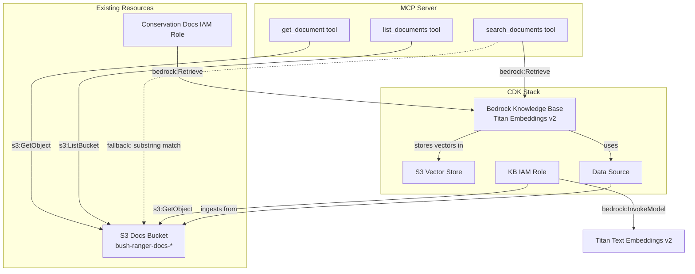

# Design Document: Bedrock Knowledge Base Semantic Search

## Overview

This design replaces the naive substring-matching `search_documents` tool in the conservation_docs MCP server with semantic search powered by an Amazon Bedrock Knowledge Base. The Knowledge Base uses Amazon Titan Text Embeddings v2 to chunk and embed conservation documents from the existing S3 docs bucket, storing vectors in an S3-based vector store. The CDK stack is extended to provision the Knowledge Base, S3 vector store, data source, and IAM permissions. The MCP server gains a Bedrock `retrieve` API call path while preserving the existing `list_documents` and `get_document` tools unchanged. A fallback to the original string-matching behaviour is retained when the `KNOWLEDGE_BASE_ID` environment variable is absent.

## Architecture



The architecture adds three new CDK resources (Knowledge Base, S3 vector store, data source) alongside the existing docs bucket. At runtime, `search_documents` calls the Bedrock `retrieve` API. The `list_documents` and `get_document` tools remain pure S3 operations.

## Components and Interfaces

### 1. CDK Infrastructure (`infra/stacks/bush_ranger_stack.py`)

New private method `_create_knowledge_base()` added to `BushRangerStack`, called after `_create_docs_bucket()`.

**Resources created (all via `CfnResource` since L2 constructs are not yet available):**

| Resource | CFN Type | Purpose |
|---|---|---|
| KB IAM Role | `aws_iam.Role` | Least-privilege role for the Knowledge Base to read S3 and invoke Titan embeddings |
| Knowledge Base | `AWS::Bedrock::KnowledgeBase` | Semantic search engine with S3 vector store storage config |
| Data Source | `AWS::Bedrock::DataSource` | Points the KB at the existing docs bucket with fixed-size chunking (300 tokens, 20% overlap) |

**Stack outputs added:**
- `KnowledgeBaseId` — the KB resource ID
- `DataSourceId` — the data source resource ID

**IAM changes:**
- The existing `ConservationDocsRole` gets an additional policy statement granting `bedrock:Retrieve` on the Knowledge Base ARN.
- The `KNOWLEDGE_BASE_ID` environment variable is conceptually passed to the MCP server runtime (the actual mechanism depends on AgentCore runtime configuration).

### 2. MCP Server (`services/mcp_servers/conservation_docs/server.py`)

**New module-level elements:**
- `_KNOWLEDGE_BASE_ID`: read from `os.environ.get("KNOWLEDGE_BASE_ID")`
- `_get_bedrock_agent_runtime_client()`: returns a `boto3.client("bedrock-agent-runtime")` instance

**Modified tool — `search_documents`:**

```python
@mcp.tool()
def search_documents(query: str, max_results: int = 5) -> dict[str, Any]:
```

- Parameter renamed from `keyword` to `query` to reflect semantic intent.
- New optional `max_results` parameter (default 5, capped at 20).
- If `_KNOWLEDGE_BASE_ID` is set: calls `bedrock-agent-runtime.retrieve()` and maps results.
- If `_KNOWLEDGE_BASE_ID` is not set: logs a warning and falls back to the existing substring-matching logic.

**Response structure (semantic path):**

```python
{
    "results": [
        {
            "source_uri": "s3://bucket/species/koala.md",
            "document_key": "species/koala.md",
            "category": "species",
            "text": "matched passage text...",
            "score": 0.87
        }
    ],
    "count": 1
}
```

**Response structure (error path):**

```python
{
    "error": "retrieval_error",
    "message": "Failed to retrieve from Knowledge Base: ..."
}
```

**Unchanged tools:**
- `list_documents(category: str)` — no changes
- `get_document(document_key: str)` — no changes

### 3. Result Mapping Helper

New private function `_parse_s3_uri(uri: str) -> tuple[str, str]` that extracts the S3 object key and document category from a source URI like `s3://bush-ranger-docs-.../species/koala.md`.

```python
def _parse_s3_uri(uri: str) -> tuple[str, str]:
    """Extract (object_key, category) from an S3 URI."""
```

### 4. Fallback Search Helper

The existing substring-matching logic is extracted into a private function `_fallback_search(query: str) -> dict[str, Any]` so `search_documents` can delegate to it cleanly when no Knowledge Base ID is configured.

## Data Models

### Existing Models (unchanged)

`models/documents.py` — `DocumentMetadata`, `DOCS_BUCKET_PREFIX`, `CATEGORIES` remain as-is.

### Bedrock Retrieve API Response Shape

The `bedrock-agent-runtime` `retrieve` API returns:

```python
{
    "retrievalResults": [
        {
            "content": {"text": "matched passage"},
            "location": {
                "type": "S3",
                "s3Location": {"uri": "s3://bucket/key"}
            },
            "score": 0.87
        }
    ]
}
```

Each result is mapped to the response dict described in Components and Interfaces.

### CDK Knowledge Base Configuration

| Parameter | Value |
|---|---|
| Embedding model ARN | `arn:aws:bedrock:us-east-1::foundation-model/amazon.titan-embed-text-v2:0` |
| Vector store type | S3 |
| Chunking strategy | Fixed-size |
| Max tokens per chunk | 300 |
| Overlap percentage | 20 |


## Correctness Properties

*A property is a characteristic or behavior that should hold true across all valid executions of a system — essentially, a formal statement about what the system should do. Properties serve as the bridge between human-readable specifications and machine-verifiable correctness guarantees.*

### Property 1: Knowledge Base resource is correctly configured

*For any* synthesised CDK stack, the CloudFormation template SHALL contain a `AWS::Bedrock::KnowledgeBase` resource whose embedding model ARN matches `amazon.titan-embed-text-v2:0` and whose storage configuration type is `S3`.

**Validates: Requirements 1.1, 1.2**

### Property 2: Data Source references docs bucket with correct chunking

*For any* synthesised CDK stack, the CloudFormation template SHALL contain a `AWS::Bedrock::DataSource` resource that references the docs bucket ARN and configures fixed-size chunking with a max token size of 300 and an overlap percentage of 20.

**Validates: Requirements 1.3, 1.6**

### Property 3: IAM roles have correct least-privilege permissions

*For any* synthesised CDK stack, the Knowledge Base IAM role SHALL have permissions to `s3:GetObject` on the docs bucket and `bedrock:InvokeModel` on the Titan embeddings model, and the conservation docs MCP server role SHALL have `bedrock:Retrieve` permission on the Knowledge Base resource while retaining existing `s3:GetObject` and `s3:ListBucket` permissions.

**Validates: Requirements 1.4, 4.1, 4.2**

### Property 4: Stack outputs include Knowledge Base and Data Source IDs

*For any* synthesised CDK stack, the CloudFormation template SHALL contain outputs for the Knowledge Base ID and the Data Source ID.

**Validates: Requirements 1.5**

### Property 5: Semantic search returns correctly structured results

*For any* query string and any valid Bedrock retrieval response, when `KNOWLEDGE_BASE_ID` is set, `search_documents` SHALL call the Bedrock `retrieve` API and return results where each item contains `source_uri`, `document_key`, `category`, `text`, and `score` fields.

**Validates: Requirements 2.1, 2.2**

### Property 6: S3 URI parsing round-trip

*For any* valid S3 object key composed of a known category prefix and a filename, constructing the full S3 URI and then parsing it with `_parse_s3_uri` SHALL recover the original object key and category.

**Validates: Requirements 2.3**

### Property 7: max_results parameter clamping

*For any* integer value passed as `max_results`, the value sent to the Bedrock `retrieve` API SHALL be clamped to the range [1, 20], and when not provided SHALL default to 5.

**Validates: Requirements 2.4**

### Property 8: Fallback to substring matching without Knowledge Base ID

*For any* query string, when the `KNOWLEDGE_BASE_ID` environment variable is not set, `search_documents` SHALL perform substring matching against S3 document content (the legacy behaviour) and SHALL not call the Bedrock `retrieve` API.

**Validates: Requirements 5.2**

## Error Handling

| Scenario | Behaviour |
|---|---|
| Bedrock `retrieve` API raises `ClientError` | Return `{"error": "retrieval_error", "message": "..."}` with the exception details. Do not raise. |
| `KNOWLEDGE_BASE_ID` env var missing | Log warning via `logging.warning()`, fall back to substring-matching search. |
| `max_results` < 1 or > 20 | Clamp silently to [1, 20]. |
| S3 URI in retrieval result cannot be parsed | Skip that result, log a warning, continue processing remaining results. |
| Bedrock returns empty `retrievalResults` | Return `{"results": [], "count": 0}`. |
| Existing `list_documents` / `get_document` errors | Unchanged — existing error handling preserved. |

## Testing Strategy

### Property-Based Testing

Use **Hypothesis** (already in use in the project) for property-based tests. Each property test runs a minimum of 100 iterations.

Each property-based test MUST be tagged with a comment referencing the design property:
- Format: `Feature: bedrock-knowledge-base, Property {N}: {title}`

Property tests to implement:

| Property | Test Description | Approach |
|---|---|---|
| P5: Semantic search response structure | Generate random query strings and mock Bedrock responses, verify output structure | Mock `bedrock-agent-runtime` client, generate random `retrievalResults` with Hypothesis |
| P6: S3 URI parsing round-trip | Generate random (category, filename) pairs, build URI, parse back | Pure function test with Hypothesis strategies for categories and filenames |
| P7: max_results clamping | Generate random integers, verify clamping to [1, 20] | Mock Bedrock client, inspect the `NumberOfResults` parameter passed |
| P8: Fallback behaviour | Generate random query strings with KNOWLEDGE_BASE_ID unset, verify substring path taken | Mock both S3 and Bedrock clients, verify only S3 is called |

CDK stack properties (P1–P4) are tested as unit tests against the synthesised template since they verify static CloudFormation output rather than runtime behaviour across random inputs.

### Unit Testing

Unit tests complement property tests for specific examples, edge cases, and error conditions:

| Test | Covers |
|---|---|
| `test_search_returns_structured_error_on_client_error` | Requirement 2.5 — Bedrock ClientError returns error dict |
| `test_search_fallback_logs_warning` | Requirement 5.2 — warning logged when KB ID missing |
| `test_list_documents_unchanged` | Requirement 3.1 — existing tool still works |
| `test_get_document_unchanged` | Requirement 3.2 — existing tool still works |
| `test_list_and_get_do_not_use_bedrock` | Requirement 3.3 — no Bedrock dependency |
| `test_kb_resource_in_template` | Requirements 1.1, 1.2 — KB resource in CFN template |
| `test_datasource_in_template` | Requirements 1.3, 1.6 — DataSource with chunking config |
| `test_iam_permissions_in_template` | Requirements 1.4, 4.1, 4.2 — IAM policies correct |
| `test_stack_outputs` | Requirement 1.5 — KB ID and DS ID outputs |
| `test_mcp_runtime_env_var` | Requirement 5.1 — KNOWLEDGE_BASE_ID in runtime config |
| `test_unparseable_uri_skipped` | Error handling — malformed URI in results |
| `test_empty_retrieval_results` | Error handling — empty results from Bedrock |

### Test File Organisation

- `tests/test_conservation_docs.py` — extend with new unit tests for semantic search, error handling, and fallback
- `tests/test_properties_docs.py` — extend with new property-based tests (P5–P8)
- `tests/test_stack.py` / `tests/test_properties_stack.py` — extend with CDK template assertions (P1–P4)
