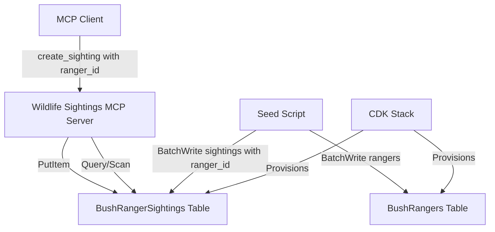

# Design Document: Ranger ID Field

## Overview

This feature adds ranger attribution to the Bush Ranger wildlife sighting system. It introduces a `ranger_id` field on sighting records to track which ranger made each observation, and creates a new `BushRangers` DynamoDB table to store ranger profile information (name, email, region, phone, active status, start date).

The design prioritizes backward compatibility — legacy sighting records without a `ranger_id` attribute will gracefully default to an empty string. The `ranger_id` field is optional on the `create_sighting` MCP tool, so existing integrations continue to work without modification.

Key changes span five layers:
1. **Data model** (`models/sightings.py`) — add `ranger_id` field to `SightingRecord`
2. **MCP server** (`services/mcp_servers/wildlife_sightings/server.py`) — accept, store, and return `ranger_id`
3. **Infrastructure** (`infra/stacks/bush_ranger_stack.py`) — provision the new `BushRangers` DynamoDB table
4. **Seed script** (`scripts/seed_sightings.py`) — generate ranger records and assign `ranger_id` to sightings
5. **Tests** — ensure existing tests pass without modification

## Architecture

The architecture remains unchanged at a high level. The new `BushRangers` table is an independent DynamoDB table with no foreign key enforcement (DynamoDB is schemaless). The `ranger_id` stored on sighting records is a logical reference, not a DynamoDB-enforced relationship.



## Components and Interfaces

### 1. SightingRecord Dataclass (`models/sightings.py`)

Add a new `ranger_id` field with a default of `""` (empty string) to maintain backward compatibility with existing code that constructs `SightingRecord` without a ranger_id.

```python
@dataclass
class SightingRecord:
    species: str
    latitude: float
    longitude: float
    date: datetime
    conservation_status: str
    observer_notes: str
    sighting_id: str | None = None
    ranger_id: str = ""
```

**Design decision**: `ranger_id` defaults to `""` rather than `None` because the MCP server already uses empty string as the sentinel for missing optional string fields (e.g., `observer_notes`). This keeps the convention consistent and avoids `None` checks throughout the codebase.

### 2. Ranger Model (`models/rangers.py`)

New file defining the ranger data model and table constants:

```python
TABLE_NAME = "BushRangers"
PARTITION_KEY = "ranger_id"

@dataclass
class RangerRecord:
    ranger_id: str
    name: str
    email: str
    region: str
    phone: str
    active: bool
    start_date: str  # ISO-8601 date
```

### 3. MCP Server Changes (`services/mcp_servers/wildlife_sightings/server.py`)

**`create_sighting` tool**: Add optional `ranger_id: str = ""` parameter. Store it in the DynamoDB item and include it in the response dict.

**`_record_to_dict` helper**: Add `ranger_id` to the output dict, defaulting to `""` for legacy records that lack the attribute:
```python
"ranger_id": item.get("ranger_id", ""),
```

This single change handles backward compatibility for all three query tools (`query_by_species`, `query_by_location`, `query_by_status`) since they all use `_record_to_dict`.

### 4. CDK Infrastructure (`infra/stacks/bush_ranger_stack.py`)

Add a new `_create_rangers_table` method that provisions the `BushRangers` DynamoDB table:

```python
def _create_rangers_table(self) -> dynamodb.Table:
    return dynamodb.Table(
        self,
        "RangersTable",
        table_name="BushRangers",
        partition_key=dynamodb.Attribute(
            name="ranger_id",
            type=dynamodb.AttributeType.STRING,
        ),
        billing_mode=dynamodb.BillingMode.PAY_PER_REQUEST,
        removal_policy=RemovalPolicy.DESTROY,
    )
```

**Design decision**: No sort key or GSI is needed for the Rangers table. Lookups are always by `ranger_id` (partition key). The table uses PAY_PER_REQUEST billing to match the existing sightings table pattern.

The Wildlife Sightings IAM role does not need access to the Rangers table — the MCP server only reads/writes sightings. The seed script uses developer credentials directly.

### 5. Seed Script (`scripts/seed_sightings.py`)

Add a list of at least 10 sample ranger profiles with realistic Australian names, emails, regions matching existing `LOCATIONS`, phone numbers, active statuses, and start dates.

New behavior:
1. Write all ranger records to the `BushRangers` table using `batch_writer`
2. When generating each sighting record, randomly select a `ranger_id` from the sample ranger list
3. Include `ranger_id` in every sighting item written to DynamoDB

## Data Models

### BushRangerSightings Table (Updated)

| Attribute            | Type   | Key       | Notes                                    |
|----------------------|--------|-----------|------------------------------------------|
| species              | String | PK        | Existing                                 |
| date_location        | String | SK        | Existing composite key                   |
| sighting_id          | String |           | UUID                                     |
| latitude             | String |           | Stored as string in DynamoDB             |
| longitude            | String |           | Stored as string in DynamoDB             |
| date                 | String |           | ISO-8601                                 |
| conservation_status  | String | GSI PK    | IUCN status                              |
| observer_notes       | String |           |                                          |
| **ranger_id**        | String |           | **New** — empty string if not provided   |

### BushRangers Table (New)

| Attribute   | Type    | Key  | Notes                          |
|-------------|---------|------|--------------------------------|
| ranger_id   | String  | PK   | e.g. "ranger-001"             |
| name        | String  |      | Full name                      |
| email       | String  |      | Contact email                  |
| region      | String  |      | Matches LOCATIONS region names |
| phone       | String  |      | Australian phone format        |
| active      | Boolean |      | Currently active ranger        |
| start_date  | String  |      | ISO-8601 date                  |

## Correctness Properties

*A property is a characteristic or behavior that should hold true across all valid executions of a system — essentially, a formal statement about what the system should do. Properties serve as the bridge between human-readable specifications and machine-verifiable correctness guarantees.*

### Property 1: Ranger ID round-trip through create_sighting

*For any* valid sighting parameters and *for any* non-empty string `ranger_id`, calling `create_sighting` with that `ranger_id` should result in the DynamoDB `put_item` call containing an item where the `ranger_id` attribute equals the provided value, and the returned response dict should contain the same `ranger_id` value.

**Validates: Requirements 2.2, 2.4**

### Property 2: Create response always contains ranger_id

*For any* valid sighting parameters (with or without an explicit `ranger_id`), the dict returned by `create_sighting` should always contain a `ranger_id` key whose value is a string.

**Validates: Requirements 2.4, 2.3**

### Property 3: Record-to-dict always includes ranger_id

*For any* DynamoDB item dict (whether or not it contains a `ranger_id` attribute), converting it via `_record_to_dict` should produce an output dict that contains a `ranger_id` key with a string value. If the input item has a `ranger_id`, the output should match it; if the input item lacks `ranger_id`, the output should default to `""`.

**Validates: Requirements 3.1, 3.2**

### Property 4: Seed sighting ranger_ids are from the valid ranger set

*For any* sighting record generated by the seed script, the `ranger_id` value should be a member of the set of `ranger_id` values defined in the sample rangers list.

**Validates: Requirements 5.3, 5.4**

## Error Handling

### Backward Compatibility with Legacy Records

Legacy sighting records in DynamoDB will not have a `ranger_id` attribute. The `_record_to_dict` helper uses `item.get("ranger_id", "")` to gracefully default to an empty string. No migration of existing data is required.

### Missing ranger_id on Create

The `ranger_id` parameter on `create_sighting` defaults to `""`. No validation error is raised for missing `ranger_id` — it is intentionally optional to maintain backward compatibility with existing callers.

### Invalid ranger_id Values

No validation is performed against the BushRangers table when creating a sighting. The `ranger_id` is stored as-is. This is a deliberate design choice — the MCP server does not have read access to the Rangers table, and enforcing referential integrity would add latency and coupling. Validation of ranger_id values (if needed) is left to the application layer.

### Seed Script Errors

The seed script uses `batch_writer` for both the Rangers and Sightings tables. If the Rangers table does not exist, the script will fail with a `ResourceNotFoundException`. The CDK stack must be deployed before running the seed script.

## Testing Strategy

### Unit Tests

Existing unit tests in `tests/test_wildlife_sightings.py` should continue to pass without modification because:
- `create_sighting` adds `ranger_id` as an optional parameter with default `""`
- `_record_to_dict` uses `.get("ranger_id", "")` so existing mock items without `ranger_id` still work

New unit tests to add:
- `test_create_sighting_with_ranger_id` — verify ranger_id is stored and returned
- `test_create_sighting_without_ranger_id` — verify default empty string behavior
- `test_record_to_dict_legacy_item` — verify legacy items without ranger_id get `""`
- `test_ranger_record_dataclass` — verify RangerRecord has all required fields
- `test_sample_rangers_count` — verify at least 10 sample rangers defined

### Property-Based Tests

Use the `hypothesis` library (already present in the project as evidenced by `.hypothesis/` directory).

Each property test should run a minimum of 100 iterations.

**Property test implementations:**

1. **Feature: ranger-id-field, Property 1: Ranger ID round-trip through create_sighting**
   Generate random non-empty strings for `ranger_id` and valid sighting parameters. Call `create_sighting` with mocked DynamoDB. Assert the `put_item` call's item contains the generated `ranger_id` and the response dict matches.

2. **Feature: ranger-id-field, Property 2: Create response always contains ranger_id**
   Generate random valid sighting parameters, optionally including or excluding `ranger_id`. Assert the response dict always has a `ranger_id` key of type `str`.

3. **Feature: ranger-id-field, Property 3: Record-to-dict always includes ranger_id**
   Generate random DynamoDB item dicts, some with `ranger_id` and some without. Assert `_record_to_dict` output always contains `ranger_id` as a string, matching the input when present or defaulting to `""`.

4. **Feature: ranger-id-field, Property 4: Seed sighting ranger_ids are from the valid ranger set**
   Generate random sighting records using the seed script's generation logic. Assert each record's `ranger_id` is in the set of defined sample ranger IDs.

Each property-based test MUST be implemented as a single `@given` decorated test function referencing its design property in a comment tag.
