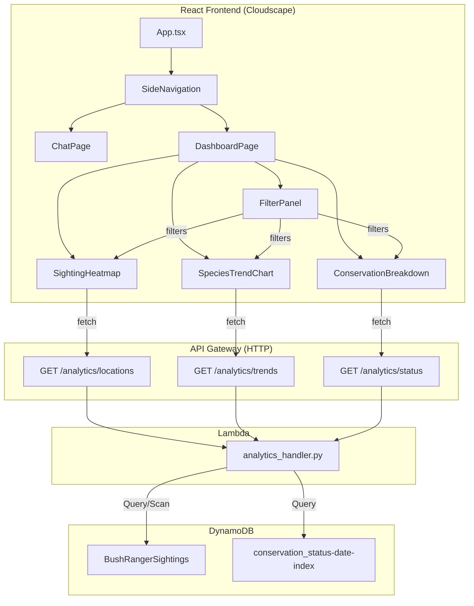

# Design Document: Sighting Analytics Dashboard

## Overview

The Sighting Analytics Dashboard adds a read-only analytics view to the Bush Ranger AI frontend. It provides park rangers with three visualizations — a location heatmap, species trend line chart, and conservation status breakdown chart — all driven by data from the existing BushRangerSightings DynamoDB table. A filter panel lets rangers narrow data by date range, species, and conservation status.

The feature introduces:
1. Three new Lambda-backed API Gateway endpoints that aggregate sighting data (read-only)
2. A new `DashboardPage` React component with sub-components for each visualization and the filter panel
3. Navigation between the existing Chat view and the new Dashboard view via Cloudscape `SideNavigation`

No data is mutated. The dashboard consumes the same DynamoDB table and GSI already provisioned for the wildlife sightings MCP server.

## Architecture



### Design Decisions

- **Single Lambda for all analytics endpoints**: A single Lambda function handles all three GET routes, differentiated by path. This keeps cold starts shared and deployment simple, matching the existing pattern of a single API Lambda.
- **Server-side aggregation**: Aggregation (grouping, counting) happens in the Lambda rather than the frontend. This avoids transferring all 1000+ raw sighting records to the client and keeps the frontend lightweight.
- **Lightweight charting with Recharts**: The project already uses React 18 and Cloudscape. Recharts is a well-maintained, lightweight React charting library that integrates naturally. It supports line charts, bar charts, pie charts, and custom tooltips out of the box.
- **Leaflet-based interactive heatmap on a map of Australia**: The heatmap renders sighting density as a heat layer on an interactive map of Australia using `react-leaflet` and the `leaflet.heat` plugin. This aligns with the requirements' emphasis on geographic locations and gives rangers a real spatial view of wildlife activity across Australian parks. Leaflet is lightweight (~40KB gzipped), uses free OpenStreetMap tiles, and `leaflet.heat` adds minimal overhead. The map is centered on Australia (lat -25.5, lng 134.5) at zoom level 4.
- **Independent data fetching per visualization**: Each chart component fetches its own data independently. A failure in one endpoint does not block the others (Requirement 7.4).

## Components and Interfaces

### Frontend Components

#### `DashboardPage`
Top-level page component rendered when the Dashboard nav item is selected.
- Manages shared filter state (`FilterState`)
- Passes filter state down to each visualization component
- Renders `FilterPanel`, `SightingHeatmap`, `SpeciesTrendChart`, `ConservationBreakdown` in a Cloudscape `Grid` layout

#### `FilterPanel`
Cloudscape-based filter controls.
- Date range: `DateRangePicker` with start/end inputs
- Species multi-select: `Multiselect` dropdown populated from a distinct species list
- Status multi-select: `Multiselect` dropdown with the 5 IUCN categories
- Reset button: `Button` that restores defaults (all species, all statuses, last 12 months)
- On any change, calls `onFilterChange(filters: FilterState)` callback

#### `SightingHeatmap`
Interactive map of Australia displaying sighting density as a heat layer.
- Fetches from `GET /analytics/locations` with current filters
- Uses `react-leaflet` `MapContainer` centered on Australia (lat -25.5, lng 134.5, zoom 4) with OpenStreetMap tile layer
- Overlays a `leaflet.heat` heat layer where each point is `[latitude, longitude, count]` — higher counts produce warmer colors (red), lower counts produce cooler colors (green/blue)
- Wraps `leaflet.heat` in a custom `HeatLayer` React component that integrates with `react-leaflet`'s layer lifecycle
- Shows empty state message when no data matches filters
- Map is interactive: rangers can pan and zoom to inspect specific park regions

#### `SpeciesTrendChart`
Line chart of sighting counts per month per species.
- Fetches from `GET /analytics/trends` with current filters
- Uses Recharts `LineChart` with one `Line` per selected species
- Tooltip shows species name, month, and count on hover
- When no species selected, shows aggregated total line

#### `ConservationBreakdown`
Bar or pie chart of sighting counts by IUCN status.
- Fetches from `GET /analytics/status` with current filters
- Uses Recharts `BarChart` with consistent color scheme (critically_endangered = red, least_concern = green)
- Clicking a segment shows a detail panel listing species in that category

#### `analyticsApi.ts`
API client module with typed fetch functions:
```typescript
fetchLocationData(filters: FilterState): Promise<LocationData[]>
fetchTrendData(filters: FilterState): Promise<TrendData[]>
fetchStatusData(filters: FilterState): Promise<StatusData[]>
```

### Backend Components

#### `analytics_handler.py`
Single Lambda function handling three routes:
- `GET /analytics/locations` — Scans table, groups by lat/lng park location, returns counts
- `GET /analytics/trends` — Queries by species (or scans), groups by month, returns time series
- `GET /analytics/status` — Queries GSI by status, counts per status category

All routes accept optional query parameters: `start_date`, `end_date`, `species` (comma-separated), `conservation_status` (comma-separated).

Validation: returns 400 with descriptive error for invalid date formats or unknown parameters.

### Navigation Changes

`App.tsx` is updated to use Cloudscape `SideNavigation` with two items: "Chat" and "Dashboard". A `currentPage` state variable controls which page renders. Dashboard state is preserved in memory when switching to Chat and back (Requirement 1.3).


## Data Models

### Frontend Types

```typescript
// Filter state shared across all dashboard components
interface FilterState {
  startDate: string;       // ISO-8601 date, default: 12 months ago
  endDate: string;         // ISO-8601 date, default: today
  species: string[];       // empty = all species
  statuses: string[];      // empty = all statuses
}

// Response from GET /analytics/locations
interface LocationData {
  latitude: number;
  longitude: number;
  locationName: string;    // human-readable park name
  count: number;           // sighting count, used as heat intensity
}

// Response from GET /analytics/trends
interface TrendData {
  month: string;           // "YYYY-MM" format
  species: string;
  count: number;
}

// Response from GET /analytics/status
interface StatusData {
  conservation_status: string;
  count: number;
  species: string[];       // species contributing to this status
}
```

### API Response Envelope

All analytics endpoints return a consistent JSON envelope:

```json
{
  "data": [ ... ],
  "count": 42,
  "filters_applied": {
    "start_date": "2024-06-01",
    "end_date": "2025-06-01",
    "species": [],
    "conservation_status": []
  }
}
```

### DynamoDB Access Patterns

| Endpoint | Access Pattern | Table/Index |
|---|---|---|
| `/analytics/locations` | Scan with optional date/species/status filter | Main table |
| `/analytics/trends` | Query by species partition key with date range on sort key; or Scan if no species filter | Main table |
| `/analytics/status` | Query GSI by conservation_status with date range | `conservation_status-date-index` GSI |

### CDK Additions

- New Lambda function `AnalyticsFunction` with read-only DynamoDB permissions (`dynamodb:Query`, `dynamodb:Scan`) on the sightings table and GSI
- Three new API Gateway routes (`GET /analytics/locations`, `GET /analytics/trends`, `GET /analytics/status`) with JWT authorizer
- CORS configuration updated to allow GET method in addition to existing POST

### Frontend Dependencies

New npm packages required for the heatmap visualization:
- `leaflet` — core mapping library
- `react-leaflet` — React bindings for Leaflet
- `leaflet.heat` — lightweight heatmap plugin for Leaflet
- `@types/leaflet` — TypeScript type definitions (devDependency)


## Correctness Properties

*A property is a characteristic or behavior that should hold true across all valid executions of a system — essentially, a formal statement about what the system should do. Properties serve as the bridge between human-readable specifications and machine-verifiable correctness guarantees.*

### Property 1: Heat layer intensity monotonicity

*For any* two `LocationData` entries with different sighting counts, the entry with the higher count must produce a higher intensity value in the `[lat, lng, intensity]` triple passed to the `leaflet.heat` layer than the entry with the lower count.

**Validates: Requirements 2.2**

### Property 2: Heat layer points contain valid coordinates

*For any* `LocationData` entry returned by the heatmap data source, the corresponding heat layer point must contain the latitude and longitude values from that entry, and both must fall within Australia's bounding box (lat: -44 to -10, lng: 112 to 154).

**Validates: Requirements 2.4**

### Property 3: Trend lines match selected species

*For any* non-empty set of selected species in the filter state, the trend chart data must contain exactly one trend line per selected species and no trend lines for unselected species.

**Validates: Requirements 3.3**

### Property 4: Conservation status color urgency ordering

*For any* two IUCN statuses where one is more threatened than the other (critically_endangered > endangered > vulnerable > near_threatened > least_concern), the color assigned to the more threatened status must have a higher visual urgency (e.g., closer to red) than the less threatened status.

**Validates: Requirements 4.3**

### Property 5: Status detail species list accuracy

*For any* `StatusData` entry, the `species` array must contain exactly the set of species that have sightings with that conservation status in the current filtered dataset.

**Validates: Requirements 4.5**

### Property 6: Filter reset restores defaults

*For any* `FilterState` (with arbitrary date range, species selection, and status selection), applying the reset action must produce a `FilterState` equal to the default state (all species, all statuses, last 12 months).

**Validates: Requirements 5.6**

### Property 7: Aggregation count conservation

*For any* analytics endpoint (locations, trends, or status) and *for any* set of sighting records matching the applied filters, the sum of all `count` values in the grouped response must equal the total number of matching sighting records.

**Validates: Requirements 6.1, 6.2, 6.3**

### Property 8: Filter application correctness

*For any* set of sighting records and *for any* valid combination of filter parameters (start_date, end_date, species, conservation_status), every record included in the API response must satisfy all applied filter criteria, and no record satisfying all criteria may be excluded.

**Validates: Requirements 6.4**

### Property 9: Response envelope consistency

*For any* valid request to any analytics endpoint, the JSON response must contain the keys `data` (array), `count` (integer equal to the length of `data`), and `filters_applied` (object reflecting the query parameters).

**Validates: Requirements 6.5**

### Property 10: Invalid parameters return 400

*For any* request to an analytics endpoint with an invalid filter parameter (malformed date, unrecognized query key), the API must return HTTP 400 with a JSON body containing an `error` key with a non-empty descriptive message.

**Validates: Requirements 6.6**

### Property 11: Read-only operations

*For any* request to any analytics endpoint, the set of items in the BushRangerSightings DynamoDB table before and after the request must be identical — no items are created, modified, or deleted.

**Validates: Requirements 6.7**

### Property 12: Independent visualization rendering

*For any* combination of analytics endpoint failures (0 to 3 endpoints failing), the visualizations backed by non-failing endpoints must still render successfully with correct data.

**Validates: Requirements 7.4**


## Error Handling

### Frontend Error Handling

| Scenario | Behavior |
|---|---|
| Analytics API returns HTTP error | Display Cloudscape `Alert` with error message and a "Retry" button on the affected visualization. Other visualizations remain functional. |
| Network timeout (30s) | Show "Request timed out. Please try again." with retry button. |
| Empty dataset | Show informational message "No sightings match the current filters" in the affected chart area. |
| Invalid filter state | Prevent submission; date range picker validates start ≤ end. |

Each visualization component manages its own loading/error/success state independently via a `useAnalyticsData` custom hook that encapsulates fetch, retry, and error state.

### Backend Error Handling

| Scenario | Response |
|---|---|
| Invalid date format in query params | 400 `{"error": "Invalid date format. Use ISO-8601 (YYYY-MM-DD)."}` |
| Unknown query parameter | 400 `{"error": "Unknown parameter: {param}"}` |
| DynamoDB throttling | 500 `{"error": "Service temporarily unavailable. Please retry."}` with exponential backoff in Lambda |
| Unhandled exception | 500 `{"error": "Internal server error"}` — details logged to CloudWatch, not exposed to client |

## Testing Strategy

### Property-Based Testing

**Frontend (TypeScript):** Use `fast-check` (already in devDependencies) with Vitest. Each property test runs a minimum of 100 iterations.

**Backend (Python):** Use `hypothesis` (already in test dependencies) with pytest. Each property test runs a minimum of 100 examples.

Each property-based test must reference its design property with a comment tag:
`Feature: sighting-analytics-dashboard, Property {N}: {title}`

Properties to implement as property-based tests:
- Property 1: Heat layer intensity monotonicity — frontend test with `fast-check`
- Property 2: Heat layer points contain valid coordinates — frontend test with `fast-check`
- Property 3: Trend lines match selected species — frontend test with `fast-check`
- Property 4: Conservation status color urgency — frontend test with `fast-check`
- Property 5: Status detail species list accuracy — backend test with `hypothesis`
- Property 6: Filter reset restores defaults — frontend test with `fast-check`
- Property 7: Aggregation count conservation — backend test with `hypothesis`
- Property 8: Filter application correctness — backend test with `hypothesis`
- Property 9: Response envelope consistency — backend test with `hypothesis`
- Property 10: Invalid parameters return 400 — backend test with `hypothesis`
- Property 11: Read-only operations — backend test with `hypothesis`
- Property 12: Independent visualization rendering — frontend test with `fast-check`

### Unit Testing

Unit tests complement property tests for specific examples and edge cases:

**Frontend unit tests (Vitest + Testing Library):**
- Dashboard navigation renders correct page (Req 1.1)
- Dashboard not accessible when unauthenticated (Req 1.2)
- Dashboard state preserved on nav switch (Req 1.3)
- Heatmap empty state message (Req 2.5)
- Default filter values on load (Req 5.5)
- Loading indicators during fetch (Req 7.1)
- Error message and retry button on API failure (Req 7.2, 7.3)

**Backend unit tests (pytest):**
- Location aggregation with known dataset (Req 6.1)
- Trend aggregation with known dataset (Req 6.2)
- Status aggregation with known dataset (Req 6.3)
- Aggregated trend with no species filter returns total (Req 3.5)

### Test File Locations

- Frontend property tests: `tests/frontend/dashboard-properties.test.tsx`
- Frontend unit tests: `tests/frontend/dashboard.test.tsx`
- Backend property tests: `tests/test_properties_analytics.py`
- Backend unit tests: `tests/test_analytics.py`
